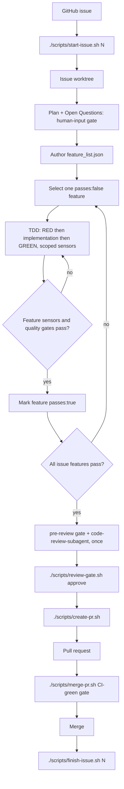

# Copilot Harness Lifecycle

This repository is a reusable harness for issue-driven Copilot work. The harness keeps the
project contract in GitHub Issues, the implementation isolated in per-issue worktrees, and the
agent steering loop grounded in local sensors.

For harness-enabled projects, the harness lifecycle is mandatory and stricter than generic Copilot or personal
workflow rules. If another instruction conflicts with this lifecycle, use the harness rule.

## Harness Layers

The harness is organized in three layers so that stable lifecycle behavior stays
separate from replaceable language support and project-specific conventions:

- **Core Harness** — the language-neutral lifecycle: preflight, per-issue
  worktrees, local progress tracking, the review gate, and PR closeout. Its
  behavior is frozen in the machine-readable contract
  [docs/harness-contract.yml](harness-contract.yml) and guarded by
  `tests/scripts/test_harness_contract.sh`. The owner scripts
  (`scripts/issue-lib.sh`, `trace-lib.sh`, `start-issue.sh`,
  `check-feature-list.sh`, `review-gate.sh`, `create-pr.sh`, `merge-pr.sh`,
  `finish-issue.sh`) must stay
  language-neutral. The `scripts/` language & structure policy — what stays
  bash, what may become Python (trigger-based), and the split thresholds — is
  recorded in
  [docs/scripts-language-policy.md](scripts-language-policy.md).
- **Language Profiles** — declarative descriptors in `profiles/<id>.profile.sh`
  that teach `init.sh` how to detect a project surface and run its gates. The
  shipped set is **Python and Node.js** (proven adopters); **Go, Java, and Ruby**
  are generator-supported — regenerate them on demand with
  `scaffold-language.sh`. The core does not hard-code any language; it loads the
  matching profile. See
  [profiles/README.md](../profiles/README.md) for the descriptor contract and
  [docs/multi-language-profiles.md](multi-language-profiles.md) for the design.
- **Framework Templates** — project-specific conventions layered on top of a
  profile (e.g. FastAPI/Django for Python, Spring Boot/Quarkus for Java). These
  live in the adopting project's own docs and instruction files, never in the
  core. A profile only declares framework *hints*; it never forces a framework.

### Adding or updating a language profile

Use the generator rather than hand-copying assets:

```sh
./scripts/scaffold-language.sh <python|go|node|java|ruby>          # dry run
./scripts/scaffold-language.sh <profile> --write                  # create missing assets
./scripts/scaffold-language.sh <profile> --update                 # overwrite a differing asset (after showing the diff)
```

The generator is idempotent and conservative: it refuses unknown profiles, does
not overwrite project-specific files without `--write`, creates or updates the
matching `.copilot/instructions/<language>.instructions.md`, reports the gates the
profile adds to `init.sh`, and leaves the issue / worktree / review-gate scripts
untouched. After adding a profile, add a `tests/scripts/test_<id>_profile.sh`
regression sensor and extend the multi-surface `tests/scripts/test_init_gates.sh`
e2e fixture so the new surface is exercised.

### Non-regression contract

The frozen lifecycle in [docs/harness-contract.yml](harness-contract.yml) is the
single source of truth for Core Harness behavior. Before changing any lifecycle
script, keep these sensors green:

- `tests/scripts/test_harness_contract.sh` — scripts still satisfy the contract
  (required scripts exist and parse; declared lifecycle steps, env flags, state
  transitions, and failure modes still appear; owner scripts stay
  language-neutral).
- `tests/scripts/test_init_gates.sh` — `init.sh` still detects every surface and
  runs the matching gates.

The full sensor suite (`tests/scripts/test_*.sh` and `tests/meta/test_*.sh`) runs
in CI and is a hard precondition for merge (see [CI Boundary](#ci-boundary)).

## Lifecycle



The normal path is:

1. Create or pick a GitHub issue with concrete acceptance criteria and sensors.
2. Run `./scripts/start-issue.sh <N>` from the main checkout.
3. Work inside `<repo>/.worktrees/issue-NN`, not directly on the main checkout.
   Keeping worktrees under the repository trust boundary avoids sibling-path
   sandbox denials. During migration, lifecycle scripts still resolve an
   already-existing sibling `<repo>-worktrees/issue-NN` worktree.
4. Plan the issue in `.copilot-tracking/issues/issue-NN/plan.md`, surface Open Questions to the
   **human-input gate**, then author `feature_list.json` from the confirmed plan (each feature
   carrying its `regression_sensor` / `e2e_sensor`). See
   [The breakdown flow](#the-breakdown-flow-plan--clarify--feature_list).
5. Pick one `passes:false` feature.
6. Deliver it yourself with TDD — RED sensor, minimal production implementation, GREEN verified
   with scoped sensors (`./scripts/run-sensors.sh green`), record any `deviation`
   spans, and flip `passes:true` (#352: one agent, no handback choreography).
7. Repeat until all features pass.
8. Run `./scripts/run-sensors.sh --gate pre-review`, then `code-review-subagent` on the completed diff. The reviewer applies the product-quality scorecard during review before closeout, following
  [docs/evaluation/product-quality-rubric.md](evaluation/product-quality-rubric.md), and performs an
  adversarial test-quality pass before closeout. It may add and execute the smallest independent test, fixture,
  smoke, or validation asset needed, but production remains read-only and the reviewer must not edit it.
9. Run `./scripts/review-gate.sh approve` for the current HEAD.
10. Open the PR with `./scripts/create-pr.sh --title "..." --body-file body.md`.
11. Merge the PR when checks are green and findings are resolved.
12. Run `./scripts/finish-issue.sh <N>` from the main checkout.

All shell entrypoints live under `scripts/`. The repository root does not carry `.sh` entrypoints;
root-level copies are stale by definition and should be removed instead of documented.

### The breakdown flow (plan → clarify → feature_list)

Who turns the issue into `feature_list.json`, and when, is fixed — the breakdown
is never authored before a plan exists, and never while a human still owes a
decision:

1. **Plan and surface decisions.** Research the issue, write the plan in
   `.copilot-tracking/issues/issue-NN/plan.md`, and list an explicit **Open Questions /
   Needs-Human-Input** section.
2. **Run the human-input gate.** Relay open questions to the human and **pause**. No breakdown
   is authored while any open question is unresolved.
3. **Author the breakdown.** Once the human resolves the questions, author `feature_list.json`
   from the confirmed plan, each feature carrying its `regression_sensor` / `e2e_sensor`.
4. **The GitHub issue stays the contract; `feature_list.json` is the derived breakdown.**

This keeps decisions that need a human in front of the human *before* any breakdown is
committed (#352: one agent owns plan, breakdown, and delivery).

#### What counts as one feature

When authoring the breakdown in step 3, granularity is fixed by one rule (the
authority is the *What counts as one feature* subsection in
[.copilot/instructions/harness.instructions.md](../.copilot/instructions/harness.instructions.md)):
a feature is one externally observable acceptance criterion provable by **exactly one**
`regression_sensor` (plus an `e2e_sensor` when it crosses a real runtime boundary). **Split** a
candidate when it needs more than one independent sensor or mixes more than one concern; **merge**
two candidates when they share a single sensor and cannot be verified independently. The sensor is
the unit — every `feature_list` item names exactly one `regression_sensor`, and no two items share
one.

## Agent Topology (#352: one agent + one reviewer)

The lifecycle is delivered by **one agent in one continuous context** per issue. It plans,
authors the breakdown, implements with TDD, runs scoped sensors, records its own
`deviation` spans, and drives the boundary scripts. The **only other model
invocation** is `code-review-subagent` — invoked once, pre-PR, over the whole branch diff, in a
fresh context with no visibility into the delivery conversation (that independence is what made
it the harness's most effective defect catcher). `repair`-mode re-reviews after a
`NEEDS_REVISION` are scoped to the revised features. If the runner does not register the
`code-review-subagent` agent name from its `.agent.md` file, the fallback is unchanged: invoke a
fresh (blank/current) subagent and paste the full role contract from the agent file.

The retired conductor/generator/planning role choreography (late-2025 pattern) and its handback
payload protocol are documented in git history; historical traces carrying those role names
remain valid.

### Running the audit sweep

The six audit skills (`dead-code-detection`, `find-brute-force`, `find-duplicates`, `find-over-design`,
`security-audit`, `sync-docs`) can also be run over the whole repo in one shot with
[`scripts/audit-sweep.sh`](../scripts/audit-sweep.sh): it launches each skill in its **own fresh, report-only
`copilot -p` session** (never one shared context — six whole-repo audits would exhaust a single window) and
consolidates the per-skill reports into one `logs/audit/<UTC-timestamp>/index.md` roll-up.

```sh
./scripts/audit-sweep.sh                     # all six audit skills
./scripts/audit-sweep.sh find-duplicates security-audit   # a subset
./scripts/audit-sweep.sh --dry-run           # print the per-skill commands, run nothing
```

`logs/audit/` is gitignored — the reports are local artifacts, never committed. The `.copilot/prompts/audit-sweep.prompt.md`
one-shot prompt drives the same script and summarizes the Fix-now findings back to you. The sweep is report-only, so
`sync-docs`'s fix mode still runs manually. This script is also the future entry point for the (blocked, #256)
scheduled-CI audit.

## Local Tracking

`.copilot-tracking/` is gitignored local state. It is persistent on the developer machine but never pushed.

| Path | Purpose |
| --- | --- |
| `.copilot-tracking/issues/issue-NN/feature_list.json` | Per-issue feature breakdown, including `steps`, `passes`, `regression_sensor`, `e2e_sensor`, `teeth_proof`, `blocked_on`, and `verification`. |
| `.copilot-tracking/issues/issue-NN/progress.md` | Running local log of completed features, verification, commits, and next work. |
| `.copilot-tracking/issues/issue-NN/plan.md` | Optional local implementation plan for non-trivial issue work. |
| `.copilot-tracking/plans/*.md` | Local deep-plan documents (multi-issue runs, prompts). |
| `.copilot-tracking/review-gate/approved-head` | Local marker written by `./scripts/review-gate.sh approve`; must match current HEAD before `./scripts/create-pr.sh` opens a PR. |

`progress.md` includes an Action Log section rendered from trace spans (#332), covering substantive lifecycle actions,
subagent handbacks, verification results, review outcomes, and any deviation stop/report/recover entry.

While an issue is open, the **worktree** copy of `progress.md` is authoritative: `scripts/log-handback.sh` writes
each Action Log line there (see Trace emission below). Before migration,
`./scripts/finish-issue.sh` atomically replaces its first in-flight `Status:`
line with a write-once `Conclusion:` containing `merged` or `abandoned` and the
latest trace-derived review verdict (`APPROVED`, `NEEDS_REVISION`, or `n-a`).
A merged conclusion requires a merged GitHub PR whose head is the exact issue
branch; abandonment requires explicit `ABANDONED=1`. An identical conclusion is
idempotent, while a conflicting conclusion is never overwritten.

`./scripts/finish-issue.sh` then migrates that worktree `progress.md` before the economics stamp and before `git worktree remove`.
Its `progress_migrate` stage calls `best_effort_progress_migrate` (`scripts/finish-lib.sh`) to copy the file verbatim
into the issue's tracking directory at the **main checkout** root. This mirrors `trace.jsonl`'s survival rationale — a linked worktree is
deleted by teardown, so the migrated main-root `progress.md` survives it the same way `trace.jsonl` does, staying
available for the post-hoc `check-trace-consistency.sh` audit. The copy helper
is failure-atomic and independently warn-only, but closeout treats a missing,
unsafe, unwritable, or failed migration as a hard pre-teardown block. This
prevents worktree removal from destroying the only finalized record.

At closeout, `./scripts/finish-issue.sh <N>` auto-stamps a **delivery economics** block into the issue `progress.md`
(between `<!-- delivery-economics:start -->` / `<!-- delivery-economics:end -->` markers, idempotently) directly from
the issue trace and `feature_list.json` — no hand-entered numbers. The block reports wall-clock span as both
first→last elapsed time and active time (the sum of chronologically adjacent gaps up to and including 30 minutes;
gaps over 30 minutes are excluded in full), token totals with run coverage, review rounds, deviations logged, and feature counts (passes:true and
teeth-proof coverage). Every row obeys the **omit-never-fake / null-never-0** rule: a metric that was not actually
measured is **omitted entirely** and never fabricated as `0` or a half-present `n/a` placeholder. In particular the
trace-derived token row appears only when a runtime adapter reported `gen_ai.usage.*` on model spans; otherwise it is
omitted — issue #329 retired the old `- Tokens: n/a` line, because a half-present field is worse than an absent one.

**Native-record economics join (issue #329).** Because the GitHub Copilot runtime does not carry `gen_ai.usage.*` on
model spans, closeout ALSO joins real token/model economics from the local Copilot **native session records** at
`${COPILOT_CLI_STATE_ROOT:-~/.copilot/session-state}/<COPILOT_AGENT_SESSION_ID>/events.jsonl`, rendered as a clearly
labelled second economics block. Only honest derived aggregates cross into the record, never raw event content: a
**subagent-only** token total (the single `totalTokens` per `subagent.completed` event — never split into a fabricated
input/output pair, and excluding the top-level session), the distinct subagent **model** names with per-model
counts/tokens, and the subagent tool-call and duration sums. A `subagent.completed` record is aggregated **only** when
all four required economics fields are genuinely present with correct types (a non-empty string `model` and
non-negative numeric `totalTokens`/`totalToolCalls`/`durationMs`); an incomplete or malformed record is **excluded
whole**, never mapped to an `unknown` model or a fabricated `0`. The field-presence check is about type/presence, not
content sanity, so a `model` label — untrusted local text — is rendered through a display-only **sanitization**
boundary (`sanitize_model` inside `render_native_economics`): every C0 control character (including CR/LF) is
stripped to a space, runs collapse, ends trim, and the visible label is capped at 60 characters with a `…` marker.
This keeps the markdown block bounded, single-line, and safe against the `<!-- delivery-economics:start/end -->`
markers `economics_stamp_into` matches by exact line equality, while the honest join/grouping in
`compute_native_economics` keeps aggregating on the **raw** model string — cardinality and totals are unaffected by
this rendering-time transform. The join is **windowed** by the issue trace's own
first→last timestamp, so events from other issues in a long shared session are excluded. **AIU** is a windowed delta
of the cumulative `session.usage_checkpoint` / `session.compaction_complete` `totalNanoAiu` counter, emitted **only**
when a checkpoint at/before the window start gives a baseline, at least one checkpoint inside the window shows
movement, AND the window-end value has not decreased below the baseline; a decrease (session reset/rollback) omits the
field entirely (never a negative, never a masked `0`), while an equal value is a genuinely measured zero. When the
session id, the events file, `jq`, the window, or a
field is unavailable (CI, adopter machines), every native field/row **fails open and is omitted** — never zeroed,
never `n/a`. This native-record join **supersedes** the cloud token-capture approach tracked in **#163** (per the #305
direction): #163 is no longer the prerequisite for non-`n/a` token rows but the complementary cloud-side path the local
join now stands in for. The frozen `trace-summary.json` `tokens` field stays `null` (no model spans carry usage);
`trace-report.sh --all` folds the final native economics spans into deterministic version buckets.

A review round is a distinct logical review event, not a per-feature `review_verdict` span. Events are keyed by
`harness.review_event_id` when present; historical spans without an explicit ID fall back to
`(harness.reviewed_sha, harness.review_mode)`. All verdicts sharing one key form one event, and one failing child
makes the event fail. If any verdict lacks valid and unambiguous event identity — it carries no explicit
`review_event_id`, no valid SHA/mode pair, or has legacy coordinates shared by multiple explicit-ID events — the
Markdown count is `n/a` with identity coverage and the numeric count is omitted with matching coverage fields; no
verdict spans remains a measured `0`. Mixed traces (some explicit IDs, some legacy SHA/mode) use unambiguous bridge
semantics: a legacy span whose coordinates match exactly one explicit event bridges to that event (same logical
event, no double-count); pure legacy coordinates with no matching explicit-ID span retain the SHA/mode fallback;
legacy coordinates shared by multiple explicit-ID events are ambiguous and render the round count `n/a` with the
numeric count omitted.

`./scripts/check-feature-list.sh <N>` is a lightweight feature-list lifecycle guard. It validates that an issue's
`feature_list.json` is well formed — valid JSON object; every `.features[]` item has `id`, `title`, an array `steps`,
and a boolean `passes`; and any `passes:true` feature carries non-empty `verification` text — and reports completion
state. Incomplete (`passes:false`) features are a non-blocking warning by default and a hard failure under
`REQUIRE_FEATURES_COMPLETE=1`. `./scripts/finish-issue.sh` reuses this same check, so the two paths cannot drift. It
is deliberately generic: it does not read project docs, devcontainers, CI, or any sensor registry, and never executes
anything from the feature list.

### Durable class lessons

A successful escalated class repair (see the Same-Class Escalation doctrine) appends a one- or
two-line durable lesson to `AGENTS.md` or a `.copilot/instructions/*.instructions.md` file; the
trace carries only the path and one-line summary of that lesson, never its body.

## Gates And Sensors

`./scripts/init.sh` detects project surfaces and runs the matching local gates when present. Each language is
driven by its profile descriptor in `profiles/<id>.profile.sh`, not by hard-coded branches:

- docs-only: reports that no language gates are present and points agents to shellcheck for touched harness scripts. (markdownlint stays available as optional docs hygiene; it is not a required gate.)
- Python (`pyproject.toml`): `uv sync --all-groups`, ruff format/check, mypy, and pytest.
- Go (`go.mod`): `gofmt -l`, `go vet ./...`, optional golangci-lint, and `go test ./...`.
- Node.js (`package.json`): prettier, eslint, optional tsc, and the project's test script — pnpm when the project declares it, otherwise npm.
- Java (`pom.xml`, `build.gradle`, or `build.gradle.kts`): optional Spotless and Checkstyle/PMD/SpotBugs, plus the test task — Maven or Gradle, preferring `./mvnw`/`./gradlew` wrappers.
- Ruby (`Gemfile`): standardrb or RuboCop and RSpec or Minitest, plus a typecheck gate only when Sorbet/Steep is configured.
- Terraform: `terraform fmt -check -recursive`, plus `terraform validate` when initialized.

Missing optional tools are explicit skips or warnings. Hard requirements such as `git`, `gh`, and GitHub auth remain
hard failures.

markdownlint is treated as **optional** docs hygiene, not a required harness gate — markdownlint is not
part of the pre-commit, end-of-session, or pre-PR gates. The devcontainer pin for it is likewise optional
tooling, not a mandatory harness requirement. Run markdownlint ad hoc for optional Markdown style
feedback; a red markdownlint result never blocks issue work.

### Trace emission

Every lifecycle script (`start-issue.sh`, `check-feature-list.sh`, `review-gate.sh`, `create-pr.sh`,
`merge-pr.sh`, `finish-issue.sh`) emits schema-v1 trace spans via `scripts/trace-lib.sh` to the per-issue trace
file `.copilot-tracking/issues/issue-NN/trace.jsonl` at the **main checkout** root — one append-only file per
issue regardless of which worktree a script runs from, so the record survives worktree teardown. The trace is
local-only, gitignored, and never committed. Tracing never blocks the lifecycle: every trace failure — including
a missing `trace-lib.sh` — is a warn-and-continue no-op. The span vocabulary and shape are frozen by the schema
contract in `docs/evaluation/observability-and-trace-schema.md` (`docs/evaluation/trace-schema.v1.json`).

At closeout `./scripts/finish-issue.sh` also appends exactly one `finish-issue.economics` **tool span** — the durable
machine-readable twin of the operator-facing delivery-economics block above. It carries the same numbers as typed JSON
numbers (`gen_ai.usage.input_tokens` / `gen_ai.usage.output_tokens` token sums, `harness.economics.token_runs` /
`harness.economics.token_runs_total` coverage, `harness.economics.review_rounds`,
`harness.economics.review_identity_covered` / `harness.economics.review_identity_total` identity coverage,
`harness.economics.deviations`,
`harness.economics.features_total` / `harness.economics.features_passing` / `harness.economics.teeth_proof`, and
`harness.economics.wall_clock_ms` / `harness.economics.active_ms` elapsed/active time), typed via the
`harness.economics.` numeric-key prefix. Issue #329 adds the **native-record** economics keys from the local Copilot
session join — `harness.economics.native_subagent_tokens`, `harness.economics.native_subagent_count`,
`harness.economics.native_tool_calls`, `harness.economics.native_duration_ms`,
`harness.economics.native_models_distinct`, and (only when checkpoints bracket the window)
`harness.economics.native_aiu_nano_delta` — each numeric via the same `harness.economics.` prefix and **omitted**
(never `0`) when the native records are unavailable. The subagent **model names** ride the operator-facing markdown
block only, never the span, because a string value under the numeric prefix would be invalid. It obeys the same
omit-never-fake rule as the block: the trace `gen_ai.usage.*` token keys are **absent** (never `0`) when no model span
carried usage. The cloud token-capture path once tracked in **#163** is now **superseded** by the native-record join
above (per #305) — #163 is no longer a prerequisite for present token keys. Likewise, `review_rounds` is absent when
review identity coverage is incomplete, while the two coverage keys explain why. The span is advisory: like all
tracing it warns-and-continues and never blocks teardown.

Conductor decisions and subagent handbacks are recorded as **agent spans** through `scripts/log-handback.sh`: the
delivering agent runs it once per recorded event (single-source), and that single invocation writes the agent span to
`trace.jsonl` — the canonical record. The `## Action Log` section in `progress.md` is **rendered** from those
spans by `scripts/render-action-log.sh` (which log-handback.sh calls after span emission), so the trace is the
single source of truth and the Action Log is a human-readable view derived from it. Never hand-author the span or
the Action Log line separately; always use `scripts/log-handback.sh` so the canonical span and the rendered view
stay in step. Full conventions (roles, lifecycle steps, deviation recording, token-usage omit-never-fake rule)
live in [harness.instructions.md §3](../.copilot/instructions/harness.instructions.md).

The harness emits lifecycle and handback spans itself. Deep GitHub Copilot
tool/model/skill analysis reads native records through the path documented in
[runtime-adapters/github-copilot.md](runtime-adapters/github-copilot.md); the
Claude Code adapter ([runtime-adapters/claude-code.md](runtime-adapters/claude-code.md))
remains a labeled reference example.

The trace record is itself audited by the **trace gate** (`./scripts/review-gate.sh trace`): it wraps the
report-only `check-trace-consistency.sh` checker — which now also owns the schema/type/redaction validation
folded from the retired `validate-trace.sh` (issue #335) — and emits one `review-gate.trace` tool span per run
with numeric finding counts. The retired log_without_span / span_without_log Action-Log reconciliation was
removed in issue #332; `progress.md` is still read for the retained `pr_mismatch` and
`finished_with_inflight_status` gates. The checker is live on real runs: in issue-number mode it reads the
main-root trace and falls back to the invoking worktree's toplevel tracking dir for `progress.md` /
`feature_list.json` (where the start-issue scaffold writes them) when the main-root copies are absent.

## Review Gate

`./scripts/review-gate.sh approve` records the current HEAD SHA in local gitignored state.
`./scripts/create-pr.sh` runs `./scripts/review-gate.sh check` before syncing, then after
`git fetch origin main` + `git rebase origin/main`, attempts to carry the prior approval forward
by patch-id identity (issue #310): if the branch's ordered patch stream is unchanged, the approval
carries automatically to the post-rebase HEAD with no second approve needed. Any content-changing
commit or sync still requires fresh review — carry applies only when the actual successful default
rebase produced exactly the pre-approved HEAD, the stored identity is a valid merge-free stable hex
identity, and the post-rebase identity is unchanged. The authoritative `check` always runs after
carry (whether carry succeeded or not): merge/non-rewrite/fallback/legacy-marker paths all require
fresh approval.

**Push contract.** `--force-with-lease` in `create-pr.sh` applies only to the run's own single-writer
feature branch — the one the issue's worktree owns exclusively — and never to `main` or any shared branch
(the on-`main` refusal at the top of the script enforces this structurally). Rebase onto `origin/main`
remains the default preference for a linear history, but it is not load-bearing: setting
`CREATE_PR_NO_REWRITE=1` skips it outright, and a `--force-with-lease` rejection that looks like a remote
force-push policy block triggers the same history-preserving fallback automatically — reset to the
pre-rebase tip, merge `origin/main` in, require a fresh review approval for the new HEAD, then push without
force. The script never issues a bare `--force` push, and a rejection that does not look like a force-push
policy block (authentication, network, or a content-based rejection such as GitHub secret-scanning push
protection) is never swallowed as a fallback trigger — it fails exactly as loudly as any other
precondition.

`review-gate.sh check` (and `finish-issue.sh`, before worktree teardown) additionally runs the trace gate
(`review-gate.sh trace`) **warn-only**: findings from the trace validator and the cross-artifact consistency checker
are printed with a `⚠` summary but do not change the exit code — live traces predating the current doctrine would
otherwise fail every in-flight run. Setting `REQUIRE_TRACE_CONSISTENCY=1` (the documented promotion flag, mirroring
`REQUIRE_FEATURES_COMPLETE`) turns findings into a hard failure: `check` exits non-zero and `finish-issue.sh` refuses
before `worktree remove`, leaving the worktree intact.

The log-completeness gate (`review-gate.sh log-completeness`) scans the per-issue Action Log `progress.md` for known
placeholder signatures that should be filled before closeout: `Recorded on completion below`, `TBD`, and
`TODO(fill`. Ordinary `review-gate.sh check` and `review-gate.sh log-completeness` use remains WARN-ONLY by default;
setting `REQUIRE_LOG_COMPLETE=1` promotes findings to a hard block. Destructive `finish-issue.sh` is stricter:
after atomically migrating `progress.md`, it atomically removes only the exact placeholder bullet and guidance
paragraph emitted by `start-issue.sh`, then always applies the shared log-completeness gate in blocking mode before
writing the terminal conclusion or removing the worktree. Any residual signature therefore leaves the worktree
intact and the durable record without a conclusion. `LOG_COMPLETENESS_PATHS` may replace the default scan target
with a whitespace-separated list of `NN` path templates. Each resolved run emits a
`review-gate.log-completeness` trace span with numeric `harness.finding_count`.

### Sensor teeth-proof obligation (retired, #334)

The teeth-proof evidence machinery — the `teeth_proof` object, the red-first ordered-triple check, and the
`teeth_proof_missing` PR block — is retired. Measured yield across real runs was zero (every real catch came
from the independent end-of-issue review), while the ceremony taxed every green. TDD remains the working
discipline; test quality is judged by the review. Historical feature lists carrying `teeth_proof` /
`teeth_proof_waiver` (or the deprecated `red_first_waiver` alias) stay valid: `check-feature-list.sh` still
shape-validates them warn-only. The `feature_start` selection-evidence gate is
also retired (#370); historical spans remain schema-valid. Waiver kinds stay
`bootstrap`, `visual-only`, `doc-only`, or `justified` with a non-empty `reason`; `teeth_proof_waiver` remains the
canonical key and `red_first_waiver` the deprecated alias (canonical wins when both are present).

## CI Boundary

`.github/workflows/harness-smoke.yml` runs the harness shell sensor suite
(`tests/scripts/test_*.sh` and `tests/meta/test_*.sh`), checks shell parsing, runs `shellcheck`
over `scripts/` and `tests/`, and validates Copilot customization frontmatter. The runner is
`ubuntu-latest`, where `git`, `jq`, and `awk` are preinstalled; the tests fake every external CLI,
so the suite needs no secrets and runs on fork PRs.

A green run is a **hard precondition for merge**: merge through `./scripts/merge-pr.sh`, which
verifies `gh pr checks` is green before merging. For belt-and-braces enforcement, a repo admin
should enable a **branch-protection required check** on `main` so the gate cannot be bypassed.

### Project-CI coverage gate

`harness-smoke.yml` runs the **harness's own** sensors — it is **not** an adopting project's CI. A
repo that ships code (Python/Go/Node/Java/Ruby) must add its own workflow that runs the project
gates (tests, lint, format, type-check). The harness makes a missing project CI visible early and
blocking at PR time:

- **Preflight WARN** — `./scripts/init.sh` warns when a code surface is present but no
  `.github/workflows/*.y*ml` other than `harness-smoke.yml` references that surface's gate
  commands. Seen at the first `start-issue`.
- **Pre-PR fail-closed `ci-gate`** — `./scripts/review-gate.sh ci-gate` (run inside
  `review-gate.sh check`, so `./scripts/create-pr.sh` enforces it with no extra step) refuses to
  open a PR under the same condition. The documented escape hatch is `SKIP_CI_GATE=1`, which
  bypasses the gate with a **logged** warning for a repo that legitimately has no project CI yet.

Detection signatures live in each `profiles/<id>.profile.sh` (`PROFILE_CI_SIGNATURES`); the
language-neutral gate scripts read them through `scripts/ci-coverage-lib.sh`, so `review-gate.sh`
and `create-pr.sh` stay free of any language token.

It is still not:

- CI/CD delivery.
- Azure deployment.
- Auto-merge or release automation.

Product repositories that adopt this harness can add their own CI/CD later, but that is outside this harness
workflow.

## Harness Versioning & Releases

The top-level `VERSION` file is the authoritative **SemVer** release identity for the harness. It is the source of
truth that `scripts/trace-lib.sh` reads for the `harness.version` stamped on every trace span; the exact commit
behind that release is carried separately by the optional `harness.commit` field (the short git SHA of the harness
scripts at emit time).

Bumping `VERSION` is **manual and deliberate** — there is no auto-increment. Bump only when observable behaviour or
the lifecycle contract changes:

- **MAJOR / MINOR** — a change to observable behaviour or the lifecycle contract (new or removed lifecycle steps,
  gate boundaries, script entrypoints, feature-list schema, or trace-schema semantics).
- **PATCH** — a behaviour-affecting bug fix that does not change the contract surface.
- **No bump** — docs-only, test-only, or comment-only commits do **not** move `VERSION`. Keeping the release stable
  across such commits is what makes `by_version` aggregation across traces meaningful.

This release version is **separate** from the `version:` field in `docs/harness-contract.yml`, which is the
contract-schema version for the frozen lifecycle contract itself. The two evolve independently: a `VERSION` bump
records a harness behaviour/release change, while the contract `version:` tracks the shape of the contract document.
