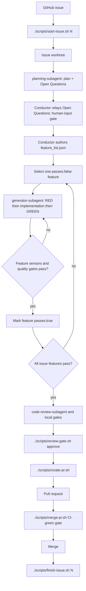

# Copilot Harness Lifecycle

This repository is a reusable harness for issue-driven Copilot work. The harness keeps the
project contract in GitHub Issues, the implementation isolated in per-issue worktrees, and the
agent steering loop grounded in local sensors.

For harness-enabled projects, the harness lifecycle is mandatory and stricter than generic Copilot or personal
workflow rules. If another instruction conflicts with this lifecycle, use the harness rule.

## Harness Layers

The harness is organized in three layers so that stable lifecycle behavior stays
separate from replaceable language support and project-specific conventions:

- **Core Harness** — the language-neutral lifecycle: preflight, per-issue
  worktrees, local progress tracking, the review gate, and PR closeout. Its
  behavior is frozen in the machine-readable contract
  [docs/harness-contract.yml](harness-contract.yml) and guarded by
  `tests/scripts/test_harness_contract.sh`. The owner scripts
  (`scripts/issue-lib.sh`, `trace-lib.sh`, `start-issue.sh`,
  `check-feature-list.sh`, `review-gate.sh`, `create-pr.sh`, `merge-pr.sh`,
  `finish-issue.sh`) must stay
  language-neutral. The `scripts/` language & structure policy — what stays
  bash, what may become Python (trigger-based), and the split thresholds — is
  recorded in
  [docs/scripts-language-policy.md](scripts-language-policy.md).
- **Language Profiles** — declarative descriptors in `profiles/<id>.profile.sh`
  that teach `init.sh` how to detect a project surface and run its gates. The
  shipped set is **Python and Node.js** (proven adopters); **Go, Java, and Ruby**
  are generator-supported — regenerate them on demand with
  `scaffold-language.sh`. The core does not hard-code any language; it loads the
  matching profile. See
  [profiles/README.md](../profiles/README.md) for the descriptor contract and
  [docs/multi-language-profiles.md](multi-language-profiles.md) for the design.
- **Framework Templates** — project-specific conventions layered on top of a
  profile (e.g. FastAPI/Django for Python, Spring Boot/Quarkus for Java). These
  live in the adopting project's own docs and instruction files, never in the
  core. A profile only declares framework *hints*; it never forces a framework.

### Adding or updating a language profile

Use the generator rather than hand-copying assets:

```sh
./scripts/scaffold-language.sh <python|go|node|java|ruby>          # dry run
./scripts/scaffold-language.sh <profile> --write                  # create missing assets
./scripts/scaffold-language.sh <profile> --update                 # overwrite a differing asset (after showing the diff)
```

The generator is idempotent and conservative: it refuses unknown profiles, does
not overwrite project-specific files without `--write`, creates or updates the
matching `.copilot/instructions/<language>.instructions.md`, reports the gates the
profile adds to `init.sh`, and leaves the issue / worktree / review-gate scripts
untouched. After adding a profile, add a `tests/scripts/test_<id>_profile.sh`
regression sensor and extend the multi-surface `tests/scripts/test_init_gates.sh`
e2e fixture so the new surface is exercised.

### Non-regression contract

The frozen lifecycle in [docs/harness-contract.yml](harness-contract.yml) is the
single source of truth for Core Harness behavior. Before changing any lifecycle
script, keep these sensors green:

- `tests/scripts/test_harness_contract.sh` — scripts still satisfy the contract
  (required scripts exist and parse; declared lifecycle steps, env flags, state
  transitions, and failure modes still appear; owner scripts stay
  language-neutral).
- `tests/scripts/test_profiles.sh` and each `tests/scripts/test_<id>_profile.sh`
  — descriptors keep their Profile Interface shape.
- `tests/scripts/test_init_gates.sh` — `init.sh` still detects every surface and
  runs the matching gates.

The full sensor suite (`tests/scripts/test_*.sh` and `tests/meta/test_*.sh`) runs
in CI and is a hard precondition for merge (see [CI Boundary](#ci-boundary)).

## Lifecycle



The normal path is:

1. Create or pick a GitHub issue with concrete acceptance criteria and sensors.
2. Run `./scripts/start-issue.sh <N>` from the main checkout.
3. Work inside `../<repo>-worktrees/issue-NN`, not directly on the main checkout.
4. **(conductor)** Author `.copilot-tracking/issues/issue-NN/feature_list.json` —
   but only *after* the `planning-subagent` plan is approved and the
   **human-input gate** has resolved every Open Question. The breakdown is the
   conductor's to write (each feature carrying its `regression_sensor` /
   `e2e_sensor`); the `planning-subagent` never authors it. See
   [The breakdown flow](#the-breakdown-flow-plan--clarify--feature_list).
5. Pick one `passes:false` feature.
6. Use `generator-subagent` for the selected feature's RED sensor, minimal production implementation, GREEN
  verification, product-quality blocking gate evidence, teeth proof, and `passes:true` update.
7. Preserve the generator's ordered `red_handback`, `impl_handback`, and `green_handback` payloads for conductor
  logging.
8. Run local gates and `code-review-subagent` on the completed diff. The reviewer applies the product-quality scorecard during review before closeout, following
  [docs/evaluation/product-quality-rubric.md](evaluation/product-quality-rubric.md), and performs an
  adversarial test-quality pass before closeout. It may add and execute the smallest independent test, fixture,
  smoke, or validation asset needed, but production remains read-only and the reviewer must not edit it.
9. Run `./scripts/review-gate.sh approve` for the current HEAD.
10. Open the PR with `./scripts/create-pr.sh --title "..." --body-file body.md`.
11. Merge the PR when checks are green and findings are resolved.
12. Run `./scripts/finish-issue.sh <N>` from the main checkout.

All shell entrypoints live under `scripts/`. The repository root does not carry `.sh` entrypoints;
root-level copies are stale by definition and should be removed instead of documented.

### The breakdown flow (plan → clarify → feature_list)

Who turns the issue into `feature_list.json`, and when, is fixed — the breakdown
is never authored before a plan exists, and never while a human still owes a
decision:

1. **`planning-subagent` plans and surfaces decisions.** It researches the issue,
   produces the plan, and lists an explicit **Open Questions / Needs-Human-Input**
   section. It never writes `feature_list.json` — its write scope is
   `.copilot-tracking/plans/` only.
2. **The conductor runs the human-input gate.** It relays those open questions to
   the human and **pauses**. No breakdown is authored while any open question is
   unresolved.
3. **The conductor authors the breakdown.** Once the human resolves the questions,
   the conductor authors `feature_list.json` from the confirmed plan, each feature
   carrying its `regression_sensor` / `e2e_sensor`.
4. **The GitHub issue stays the contract; `feature_list.json` is the derived
   breakdown.**

This keeps decisions that need a human in front of the human *before* any
breakdown is committed, and keeps breakdown authorship with the conductor — no
subagent gains the right to write it.

#### What counts as one feature

When the conductor authors the breakdown in step 3, granularity is fixed by one rule (the
authority is the *What counts as one feature* subsection in
[.copilot/instructions/harness.instructions.md](../.copilot/instructions/harness.instructions.md)):
a feature is one externally observable acceptance criterion provable by **exactly one**
`regression_sensor` (plus an `e2e_sensor` when it crosses a real runtime boundary). **Split** a
candidate when it needs more than one independent sensor or mixes more than one concern; **merge**
two candidates when they share a single sensor and cannot be verified independently. The sensor is
the unit — every `feature_list` item names exactly one `regression_sensor`, and no two items share
one.

## Copilot Roles

| Asset | Responsibility |
| --- | --- |
| `planning-subagent` | Researches the issue, reuses existing harness patterns first, and writes self-contained verifiable phases when planning is needed. |
| `generator-subagent` | Delivers one selected `feature_list` item through RED, minimal implementation, GREEN, product-quality blocking evidence, teeth proof, and `passes:true`. |
| `code-review-subagent` | Reviews spec compliance and quality, adds and executes test-only adversarial coverage when needed, applies the product-quality scorecard, and checks security, brute-force patterns, duplication, over-design, dead-code risk, and docs drift. Production assets remain read-only. |
| `session-ritual.prompt.md` | A user-invoked prompt for resuming the coding-session ritual on a specific issue. |
| Skills under `.copilot/skills/` | On-demand review, PR, security, drift, and code-quality sensors used by the conductor and review workflow. |

The conductor remains responsible for selecting the issue and feature, preserving scope, approving the current HEAD,
committing, pushing, opening PRs, and merging.

#### Unregistered-named-subagent fallback

The repo defines each role as an agent file, for example `.copilot/agents/generator-subagent.agent.md`. Some runtimes
register those agents by `agentName` and can invoke
them directly; others do not. When the current runner does **not** register the named subagent (the `agentName` is
`not registered`), the conductor uses this **fallback**: invoke a blank or current subagent and paste the full **role
contract** from that `.agent.md` file into the prompt, then record the handback under the intended role exactly as if
the named agent had run. The role boundary is defined by the contract text, not by whether the runtime knows the agent
name — so an unregistered `agentName` never becomes an excuse for the conductor to do the feature work itself.

### Skill × subagent × stage

Which skill fires, who owns it, and at which lifecycle phase:

| Skill | Owner role | Stage / phase | Fires on |
| --- | --- | --- | --- |
| `find-brute-force` | `code-review-subagent` | Review | Hacks, swallowed errors, hardcoded values introduced by the diff |
| `find-duplicates` | `code-review-subagent` | Review | Copy-paste / DRY violations introduced by the diff |
| `find-over-design` | `code-review-subagent` | Review | Premature abstraction introduced by the diff |
| `dead-code-detection` | `code-review-subagent` | Review | Dead code among symbols the diff adds, renames, routes, or removes |
| `sync-docs` | `code-review-subagent` | Review | Doc drift from touched commands, paths, agent/skill names |
| `public-exposure-audit` | `code-review-subagent` | Review + Closeout verify gate | Secrets, PII, cloud IDs, customer media in pushed/soon-to-be-pushed content (BLOCKING) |
| `code-review` | conductor · `code-review-subagent` | Review → Closeout verify gate | Pre-commit / pre-PR diff review (every commit, every PR) |
| `create-pr` | conductor | Closeout | PR title/body, issue link, acceptance criteria — behind `scripts/create-pr.sh` |
| `security-audit` | conductor (conditional) | Closeout | Issues touching auth, Azure provisioning, or data movement |

Planner and generator carry no distinctive skill; their quality bar comes from the
applicable `<language>.instructions.md` plus `tdd.instructions.md`, not a skill. The audit skills are concentrated in
`code-review-subagent` so one fresh-context pass owns whole-diff quality.

### Running the audit sweep

The six audit skills (`dead-code-detection`, `find-brute-force`, `find-duplicates`, `find-over-design`,
`security-audit`, `sync-docs`) can also be run over the whole repo in one shot with
[`scripts/audit-sweep.sh`](../scripts/audit-sweep.sh): it launches each skill in its **own fresh, report-only
`copilot -p` session** (never one shared context — six whole-repo audits would exhaust a single window) and
consolidates the per-skill reports into one `logs/audit/<UTC-timestamp>/index.md` roll-up.

```sh
./scripts/audit-sweep.sh                     # all six audit skills
./scripts/audit-sweep.sh find-duplicates security-audit   # a subset
./scripts/audit-sweep.sh --dry-run           # print the per-skill commands, run nothing
```

`logs/audit/` is gitignored — the reports are local artifacts, never committed. The `.copilot/prompts/audit-sweep.prompt.md`
one-shot prompt drives the same script and summarizes the Fix-now findings back to you. The sweep is report-only, so
`sync-docs`'s fix mode still runs manually. This script is also the future entry point for the (blocked, #256)
scheduled-CI audit.

### The conductor must not do feature work itself (non-delegable)

When the issue workflow is active, the conductor **must not directly** write the feature's tests/sensors or its
production implementation, and must not flip `passes:true`. That feature work is **non-delegable** to the conductor:
it belongs to the subagents. The required per-feature handoff is:

1. **conductor selects** one `passes:false` feature and prepares context;
2. **`generator-subagent` creates or validates the RED sensor**, confirming the expected failure;
3. **the same `generator-subagent` makes the minimal production change** to satisfy it;
4. **the same `generator-subagent` verifies GREEN**, records product-quality evidence and teeth proof, and updates
  completion status (`passes:true`);
5. **conductor commits/pushes** and records the handbacks.

A progress log that only records **"conductor TDD"** is non-compliant — it hides this handoff. See
[harness.instructions.md §3](../.copilot/instructions/harness.instructions.md) for the enforceable rule.

When a handoff step fails, the conductor runs two **grading-driven revision loops** (it owns the loop boundary;
subagents never call each other). **Loop 1 (generator repair):** a production defect or verification gap routes back
to `generator-subagent` (never weakening a declared sensor). **Loop 2 (review → generator):** a
`code-review-subagent` first maps criteria to sensors and may add and execute the smallest independent test, fixture,
smoke, or validation asset. The reviewer must not edit production; ambiguous paths and required production hooks route
to the conductor. A newly exposed production defect produces `NEEDS_REVISION` and routes through the conductor to
`generator-subagent`, then the reviewer reruns the adversarial sensor on the repaired HEAD and reports changed tests,
commands, and evidence. The implementation-usefulness grade is a routing signal, not a severity override, and repeated
failure stops and asks the human after two attempts. **Loop 3 (plan correction)** is a lightweight, conductor-owned
escape hatch on top of these two: when a `Plan first` handback, a wrong-declared-sensor handback, a review scope /
planning decision, or two failed repairs reveal that the **plan or sensor contract** — not the code — is falsified,
the conductor records the blocker in the Action Log, pauses feature work, updates the plan or re-invokes
`planning-subagent`, and resets the affected features to `passes:false` (reusing the `blocked_on` field, no new state
files). Loop 1 and Loop 2 remain the default; Loop 3 fires only when a plan assumption is wrong. Full protocol in
[harness.instructions.md §3](../.copilot/instructions/harness.instructions.md).

Conductor, generator-subagent, and code-review-subagent actions must be visible in the issue
progress Action Log. Subagents preserve their role boundaries by reporting substantive actions back to the conductor
for logging when they are not authorized to edit local issue progress directly.

## Local Tracking

`.copilot-tracking/` is gitignored local state. It is persistent on the developer machine but never pushed.

| Path | Purpose |
| --- | --- |
| `.copilot-tracking/issues/issue-NN/feature_list.json` | Per-issue feature breakdown, including `steps`, `passes`, `regression_sensor`, `e2e_sensor`, `teeth_proof`, `blocked_on`, and `verification`. |
| `.copilot-tracking/issues/issue-NN/progress.md` | Running local log of completed features, verification, commits, and next work. |
| `.copilot-tracking/issues/issue-NN/plan.md` | Optional local implementation plan for non-trivial issue work. |
| `.copilot-tracking/plans/*.md` | Local planning-subagent output for deep plans. |
| `.copilot-tracking/review-gate/approved-head` | Local marker written by `./scripts/review-gate.sh approve`; must match current HEAD before `./scripts/create-pr.sh` opens a PR. |

`progress.md` should include an Action Log section for substantive lifecycle actions, including conductor decisions,
subagent handbacks, verification results, review outcomes, and any deviation stop/report/recover entry.

While an issue is open, the **worktree** copy of `progress.md` is authoritative: `scripts/log-handback.sh` writes
each Action Log line there (see Trace emission below). Before migration,
`./scripts/finish-issue.sh` atomically replaces its first in-flight `Status:`
line with a write-once `Conclusion:` containing `merged` or `abandoned` and the
latest trace-derived review verdict (`APPROVED`, `NEEDS_REVISION`, or `n-a`).
A merged conclusion requires a merged GitHub PR whose head is the exact issue
branch; abandonment requires explicit `ABANDONED=1`. An identical conclusion is
idempotent, while a conflicting conclusion is never overwritten.

`./scripts/finish-issue.sh` then migrates that worktree `progress.md` before the economics stamp and before `git worktree remove`.
Its `progress_migrate` stage calls `best_effort_progress_migrate` (`scripts/finish-lib.sh`) to copy the file verbatim
into the issue's tracking directory at the **main checkout** root. This mirrors `trace.jsonl`'s survival rationale — a linked worktree is
deleted by teardown, so the migrated main-root `progress.md` survives it the same way `trace.jsonl` does, staying
available for the post-hoc `check-trace-consistency.sh` audit. The copy helper
is failure-atomic and independently warn-only, but closeout treats a missing,
unsafe, unwritable, or failed migration as a hard pre-teardown block. This
prevents worktree removal from destroying the only finalized record.

At closeout, `./scripts/finish-issue.sh <N>` auto-stamps a **delivery economics** block into the issue `progress.md`
(between `<!-- delivery-economics:start -->` / `<!-- delivery-economics:end -->` markers, idempotently) directly from
the issue trace and `feature_list.json` — no hand-entered numbers. The block reports wall-clock span (first→last span
elapsed), token totals with run coverage, review rounds, deviations logged, and feature counts (passes:true and
teeth-proof coverage). Every row obeys the **omit-never-fake / null-never-0** rule: a metric that was not actually
measured renders `n/a` and is never fabricated as `0` — in particular token rows read `n/a` unless a runtime adapter
reported `gen_ai.usage.*` on model spans, and model runs without token data are counted honestly in the coverage
denominator rather than invented as zero-token runs. Acquiring those Copilot-side token counts (so the token rows can
read a real number instead of `n/a` in the GitHub Copilot runtime) is the deep-trace work tracked in **#163**; until
it lands, `n/a` token rows are the honest state, not a defect.

A review round is a distinct logical review event, not a per-feature `review_verdict` span. Until **#318** adds
`harness.review_event_id`, the isolated temporary event key is
`(harness.reviewed_sha, harness.review_mode)`: all verdicts with that key form one event, and one failing child makes
the event fail. If any verdict lacks a non-empty SHA or valid review mode, the Markdown count is `n/a` with identity
coverage and the numeric count is omitted with matching coverage fields; no verdict spans remains a measured `0`.
Issue #318 will replace only this temporary key with `review_event_id` and must add a decoupling sensor proving the
economics aggregation no longer depends on `reviewed_sha` or `review_mode`.

`./scripts/check-feature-list.sh <N>` is a lightweight feature-list lifecycle guard. It validates that an issue's
`feature_list.json` is well formed — valid JSON object; every `.features[]` item has `id`, `title`, an array `steps`,
and a boolean `passes`; and any `passes:true` feature carries non-empty `verification` text — and reports completion
state. Incomplete (`passes:false`) features are a non-blocking warning by default and a hard failure under
`REQUIRE_FEATURES_COMPLETE=1`. `./scripts/finish-issue.sh` reuses this same check, so the two paths cannot drift. It
is deliberately generic: it does not read project docs, devcontainers, CI, or any sensor registry, and never executes
anything from the feature list.

## Gates And Sensors

`./scripts/init.sh` detects project surfaces and runs the matching local gates when present. Each language is
driven by its profile descriptor in `profiles/<id>.profile.sh`, not by hard-coded branches:

- docs-only: reports that no language gates are present and points agents to shellcheck for touched harness scripts. (markdownlint stays available as optional docs hygiene; it is not a required gate.)
- Python (`pyproject.toml`): `uv sync --all-groups`, ruff format/check, mypy, and pytest.
- Go (`go.mod`): `gofmt -l`, `go vet ./...`, optional golangci-lint, and `go test ./...`.
- Node.js (`package.json`): prettier, eslint, optional tsc, and the project's test script — pnpm when the project declares it, otherwise npm.
- Java (`pom.xml`, `build.gradle`, or `build.gradle.kts`): optional Spotless and Checkstyle/PMD/SpotBugs, plus the test task — Maven or Gradle, preferring `./mvnw`/`./gradlew` wrappers.
- Ruby (`Gemfile`): standardrb or RuboCop and RSpec or Minitest, plus a typecheck gate only when Sorbet/Steep is configured.
- Terraform: `terraform fmt -check -recursive`, plus `terraform validate` when initialized.

Missing optional tools are explicit skips or warnings. Hard requirements such as `git`, `gh`, and GitHub auth remain
hard failures.

markdownlint is treated as **optional** docs hygiene, not a required harness gate — markdownlint is not
part of the pre-commit, end-of-session, or pre-PR gates. The devcontainer pin for it is likewise optional
tooling, not a mandatory harness requirement. Run markdownlint ad hoc for optional Markdown style
feedback; a red markdownlint result never blocks issue work.

### Trace emission

Every lifecycle script (`start-issue.sh`, `check-feature-list.sh`, `review-gate.sh`, `create-pr.sh`,
`merge-pr.sh`, `finish-issue.sh`) emits schema-v1 trace spans via `scripts/trace-lib.sh` to the per-issue trace
file `.copilot-tracking/issues/issue-NN/trace.jsonl` at the **main checkout** root — one append-only file per
issue regardless of which worktree a script runs from, so the record survives worktree teardown. The trace is
local-only, gitignored, and never committed. Tracing never blocks the lifecycle: every trace failure — including
a missing `trace-lib.sh` — is a warn-and-continue no-op. The span vocabulary and shape are frozen by the schema
contract in `docs/evaluation/observability-and-trace-schema.md` (`docs/evaluation/trace-schema.v1.json`).

At closeout `./scripts/finish-issue.sh` also appends exactly one `finish-issue.economics` **tool span** — the durable
machine-readable twin of the operator-facing delivery-economics block above. It carries the same numbers as typed JSON
numbers (`gen_ai.usage.input_tokens` / `gen_ai.usage.output_tokens` token sums, `harness.economics.token_runs` /
`harness.economics.token_runs_total` coverage, `harness.economics.review_rounds`,
`harness.economics.review_identity_covered` / `harness.economics.review_identity_total` identity coverage,
`harness.economics.deviations`,
`harness.economics.features_total` / `harness.economics.features_passing` / `harness.economics.teeth_proof`, and
`harness.economics.wall_clock_ms`), typed via the `harness.economics.` numeric-key prefix. It obeys the same
omit-never-fake rule as the block: the token-usage keys are **absent** (never `0`) when no model span carried usage,
so a `n/a` token row and an omitted token key are the same honest signal — see **#163** for the Copilot-side token
capture that makes those keys present. Likewise, `review_rounds` is absent when review identity coverage is
incomplete, while the two coverage keys explain why. The span is advisory: like all tracing it
warns-and-continues and never blocks teardown.

Conductor decisions and subagent handbacks are recorded as **agent spans** through `scripts/log-handback.sh`: the
conductor runs it once per decision or handback, and that single invocation writes the agent span first, then the
derived Action Log line in the worktree `progress.md` — single-source from the same arguments, so the machine-readable
trace and the human-readable Action Log stay in step by construction. (Tracing can still degrade by design — trace-lib
is warn-never-fail, so a span may be dropped while the Action Log line lands; the helper warns when that happens, and
the trace ↔ Action Log consistency sensor catches any divergence post-hoc.) Never hand-author the span/log-line pair
separately. Full
conventions (roles, lifecycle steps, deviation recording, token-usage omit-never-fake rule) live in
[harness.instructions.md §3](../.copilot/instructions/harness.instructions.md).

Tool and model spans from an agent runtime (per-tool-call arguments, latency, token usage) are contributed by the
optional runtime adapters under `docs/runtime-adapters/` — GitHub Copilot is the primary runtime target
([runtime-adapters/github-copilot.md](runtime-adapters/github-copilot.md)), with the Claude Code adapter
([runtime-adapters/claude-code.md](runtime-adapters/claude-code.md)) kept as the labeled reference example of the
pattern; without one installed the trace simply lacks those spans and everything else is unchanged.

A frequent misread is expecting `harness.skill.name` skill spans (proof that a named audit skill fired) to always
appear in an issue's trace. They exist only under two preconditions — the fixed hook installed on `main` and seeded
into the worktree, and a *fresh* runtime session that surfaces the skill as a `toolName="skill"` tool span — and they
**cannot be backfilled** into an already-run session. The exact rules, the `review_verdict`-vs-skill-span distinction,
and the omit-never-fake honesty answer are documented in
[runtime-adapters/github-copilot.md §"When a `harness.skill.name` skill span exists (and when it cannot)"](runtime-adapters/github-copilot.md#when-a-harnessskillname-skill-span-exists-and-when-it-cannot).

The trace record is itself audited by the two-phase **trace gate** (`./scripts/review-gate.sh trace`): it wraps the
report-only checkers `validate-trace.sh` (schema/type/redaction) and `check-trace-consistency.sh` (trace ↔
progress.md ↔ feature list ↔ review-gate marker honesty) and emits one `review-gate.trace` tool span per run with
numeric aggregated finding counts. The consistency half is live on real runs: in issue-number mode the checker reads
the main-root trace and falls back to the invoking worktree's toplevel tracking dir for `progress.md` /
`feature_list.json` (where `log-handback.sh` and the start-issue scaffold actually write them) when the main-root
copies are absent.

## Review Gate

`./scripts/review-gate.sh approve` records the current HEAD SHA in local gitignored state.
`./scripts/create-pr.sh` runs `./scripts/review-gate.sh check` before syncing, then checks again after
`git fetch origin main` + `git rebase origin/main` before pushing or opening a PR. Any new commit or rebase that
changes HEAD requires a fresh review approval for that final HEAD.

`review-gate.sh check` (and `finish-issue.sh`, before worktree teardown) additionally runs the trace gate
(`review-gate.sh trace`) **warn-only**: findings from the trace validator and the cross-artifact consistency checker
are printed with a `⚠` summary but do not change the exit code — live traces predating the current doctrine would
otherwise fail every in-flight run. Setting `REQUIRE_TRACE_CONSISTENCY=1` (the documented promotion flag, mirroring
`REQUIRE_FEATURES_COMPLETE`) turns findings into a hard failure: `check` exits non-zero and `finish-issue.sh` refuses
before `worktree remove`, leaving the worktree intact.

The log-completeness gate (`review-gate.sh log-completeness`) scans the per-issue Action Log `progress.md` for known
placeholder signatures that should be filled before closeout: `Recorded on completion below`, `TBD`, and
`TODO(fill`. Ordinary `review-gate.sh check` and `review-gate.sh log-completeness` use remains WARN-ONLY by default;
setting `REQUIRE_LOG_COMPLETE=1` promotes findings to a hard block. Destructive `finish-issue.sh` is stricter:
after atomically migrating `progress.md`, it atomically removes only the exact placeholder bullet and guidance
paragraph emitted by `start-issue.sh`, then always applies the shared log-completeness gate in blocking mode before
writing the terminal conclusion or removing the worktree. Any residual signature therefore leaves the worktree
intact and the durable record without a conclusion. `LOG_COMPLETENESS_PATHS` may replace the default scan target
with a whitespace-separated list of `NN` path templates. Each resolved run emits a
`review-gate.log-completeness` trace span with numeric `harness.finding_count`.

### Sensor teeth-proof obligation

The L4 outcome is now SENSOR TEETH — a sensor proven able to fail via red-first, mutation, or a negative fixture —
not handback ordering for its own sake; ordering remains useful signal, but is no longer the hard bar.

`check-trace-consistency.sh` treats a `passes:true` feature as satisfied when it carries a valid first-class
`teeth_proof` object (kind `red_first`, `mutation`, or `negative_fixture`, with non-empty evidence), or a
role-correct ordered `red_handback` → `impl_handback` → `green_handback` triple, or a governed waiver. When none of
those is present it raises `VIOLATION consistency: teeth_proof_missing`. When `teeth_proof` is present but the
ordered triple is absent, it emits the warn-only `WARNING consistency: red_first_ordering_absent` as context, never as
a block.

`review-gate.sh` approve and check hard-block on `teeth_proof_missing` by default, and `create-pr.sh` inherits that
block. The ordering warning never blocks a review approval, PR creation, or closeout by itself.

The governed waiver key is now **`teeth_proof_waiver`** (canonical). The older **`red_first_waiver`** remains accepted
as a **deprecated alias** during migration. Both keys use the same explicit object shape: `kind` must be one of
`bootstrap`, `visual-only`, `doc-only`, or `justified`, and `reason` must be non-empty. If both keys are present,
`teeth_proof_waiver` wins. An empty or kind-less waiver still does not satisfy the gate.

## CI Boundary

`.github/workflows/harness-smoke.yml` runs the harness shell sensor suite
(`tests/scripts/test_*.sh` and `tests/meta/test_*.sh`), checks shell parsing, runs `shellcheck`
over `scripts/` and `tests/`, and validates Copilot customization frontmatter. The runner is
`ubuntu-latest`, where `git`, `jq`, and `awk` are preinstalled; the tests fake every external CLI,
so the suite needs no secrets and runs on fork PRs.

A green run is a **hard precondition for merge**: merge through `./scripts/merge-pr.sh`, which
verifies `gh pr checks` is green before merging. For belt-and-braces enforcement, a repo admin
should enable a **branch-protection required check** on `main` so the gate cannot be bypassed.

### Project-CI coverage gate

`harness-smoke.yml` runs the **harness's own** sensors — it is **not** an adopting project's CI. A
repo that ships code (Python/Go/Node/Java/Ruby) must add its own workflow that runs the project
gates (tests, lint, format, type-check). The harness makes a missing project CI visible early and
blocking at PR time:

- **Preflight WARN** — `./scripts/init.sh` warns when a code surface is present but no
  `.github/workflows/*.y*ml` other than `harness-smoke.yml` references that surface's gate
  commands. Seen at the first `start-issue`.
- **Pre-PR fail-closed `ci-gate`** — `./scripts/review-gate.sh ci-gate` (run inside
  `review-gate.sh check`, so `./scripts/create-pr.sh` enforces it with no extra step) refuses to
  open a PR under the same condition. The documented escape hatch is `SKIP_CI_GATE=1`, which
  bypasses the gate with a **logged** warning for a repo that legitimately has no project CI yet.

Detection signatures live in each `profiles/<id>.profile.sh` (`PROFILE_CI_SIGNATURES`); the
language-neutral gate scripts read them through `scripts/ci-coverage-lib.sh`, so `review-gate.sh`
and `create-pr.sh` stay free of any language token.

It is still not:

- CI/CD delivery.
- Azure deployment.
- Auto-merge or release automation.

Product repositories that adopt this harness can add their own CI/CD later, but that is outside this harness
workflow.

## Harness Versioning & Releases

The top-level `VERSION` file is the authoritative **SemVer** release identity for the harness. It is the source of
truth that `scripts/trace-lib.sh` reads for the `harness.version` stamped on every trace span; the exact commit
behind that release is carried separately by the optional `harness.commit` field (the short git SHA of the harness
scripts at emit time).

Bumping `VERSION` is **manual and deliberate** — there is no auto-increment. Bump only when observable behaviour or
the lifecycle contract changes:

- **MAJOR / MINOR** — a change to observable behaviour or the lifecycle contract (new or removed lifecycle steps,
  gate boundaries, script entrypoints, feature-list schema, or trace-schema semantics).
- **PATCH** — a behaviour-affecting bug fix that does not change the contract surface.
- **No bump** — docs-only, test-only, or comment-only commits do **not** move `VERSION`. Keeping the release stable
  across such commits is what makes `by_version` aggregation across traces meaningful.

This release version is **separate** from the `version:` field in `docs/harness-contract.yml`, which is the
contract-schema version for the frozen lifecycle contract itself. The two evolve independently: a `VERSION` bump
records a harness behaviour/release change, while the contract `version:` tracks the shape of the contract document.
