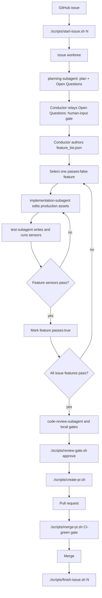

# Copilot Harness Lifecycle

This repository is a reusable harness for issue-driven Copilot work. The harness keeps the
project contract in GitHub Issues, the implementation isolated in per-issue worktrees, and the
agent steering loop grounded in local sensors.

For harness-enabled projects, the harness lifecycle is mandatory and stricter than generic Copilot or personal
workflow rules. If another instruction conflicts with this lifecycle, use the harness rule.

## Harness Layers

The harness is organized in three layers so that stable lifecycle behavior stays
separate from replaceable language support and project-specific conventions:

- **Core Harness** — the language-neutral lifecycle: preflight, per-issue
  worktrees, local progress tracking, the review gate, and PR closeout. Its
  behavior is frozen in the machine-readable contract
  [docs/harness-contract.yml](harness-contract.yml) and guarded by
  `tests/scripts/test_harness_contract.sh`. The owner scripts
  (`scripts/issue-lib.sh`, `trace-lib.sh`, `start-issue.sh`,
  `check-feature-list.sh`, `review-gate.sh`, `create-pr.sh`, `merge-pr.sh`,
  `finish-issue.sh`) must stay
  language-neutral.
- **Language Profiles** — declarative descriptors in `profiles/<id>.profile.sh`
  that teach `init.sh` how to detect a project surface and run its gates. The
  initial supported set is **Python, Go, Node.js, Java, and Ruby**. The core
  does not hard-code any language; it loads the matching profile. See
  [profiles/README.md](../profiles/README.md) for the descriptor contract and
  [docs/multi-language-profiles.md](multi-language-profiles.md) for the design.
- **Framework Templates** — project-specific conventions layered on top of a
  profile (e.g. FastAPI/Django for Python, Spring Boot/Quarkus for Java). These
  live in the adopting project's own docs and instruction files, never in the
  core. A profile only declares framework *hints*; it never forces a framework.

### Adding or updating a language profile

Use the generator rather than hand-copying assets:

```sh
./scripts/scaffold-language.sh <python|go|node|java|ruby>          # dry run
./scripts/scaffold-language.sh <profile> --write                  # create missing assets
./scripts/scaffold-language.sh <profile> --update                 # overwrite a differing asset (after showing the diff)
```

The generator is idempotent and conservative: it refuses unknown profiles, does
not overwrite project-specific files without `--write`, creates or updates the
matching `.copilot/instructions/<language>.instructions.md`, reports the gates the
profile adds to `init.sh`, and leaves the issue / worktree / review-gate scripts
untouched. After adding a profile, add a `tests/scripts/test_<id>_profile.sh`
regression sensor and extend the multi-surface `tests/scripts/test_init_gates.sh`
e2e fixture so the new surface is exercised.

### Non-regression contract

The frozen lifecycle in [docs/harness-contract.yml](harness-contract.yml) is the
single source of truth for Core Harness behavior. Before changing any lifecycle
script, keep these sensors green:

- `tests/scripts/test_harness_contract.sh` — scripts still satisfy the contract
  (required scripts exist and parse; declared lifecycle steps, env flags, state
  transitions, and failure modes still appear; owner scripts stay
  language-neutral).
- `tests/scripts/test_profiles.sh` and each `tests/scripts/test_<id>_profile.sh`
  — descriptors keep their Profile Interface shape.
- `tests/scripts/test_init_gates.sh` — `init.sh` still detects every surface and
  runs the matching gates.

The full sensor suite (`tests/scripts/test_*.sh` and `tests/meta/test_*.sh`) runs
in CI and is a hard precondition for merge (see [CI Boundary](#ci-boundary)).

## Lifecycle



The normal path is:

1. Create or pick a GitHub issue with concrete acceptance criteria and sensors.
2. Run `./scripts/start-issue.sh <N>` from the main checkout.
3. Work inside `../<repo>-worktrees/issue-NN`, not directly on the main checkout.
4. **(conductor)** Author `.copilot-tracking/issues/issue-NN/feature_list.json` —
   but only *after* the `planning-subagent` plan is approved and the
   **human-input gate** has resolved every Open Question. The breakdown is the
   conductor's to write (each feature carrying its `regression_sensor` /
   `e2e_sensor`); the `planning-subagent` never authors it. See
   [The breakdown flow](#the-breakdown-flow-plan--clarify--feature_list).
5. Pick one `passes:false` feature.
6. Use `implementation-subagent` for production assets only.
7. Use `test-subagent` for tests, smoke checks, sensor execution, and product-quality blocking gate evidence from
   [docs/evaluation/product-quality-rubric.md](evaluation/product-quality-rubric.md) before marking `passes:true`.
8. Run local gates and `code-review-subagent` on the completed diff; the reviewer applies the product-quality
   scorecard from [docs/evaluation/product-quality-rubric.md](evaluation/product-quality-rubric.md) during review
   before closeout.
9. Run `./scripts/review-gate.sh approve` for the current HEAD.
10. Open the PR with `./scripts/create-pr.sh --title "..." --body-file body.md`.
11. Merge the PR when checks are green and findings are resolved.
12. Run `./scripts/finish-issue.sh <N>` from the main checkout.

All shell entrypoints live under `scripts/`. The repository root does not carry `.sh` entrypoints;
root-level copies are stale by definition and should be removed instead of documented.

### The breakdown flow (plan → clarify → feature_list)

Who turns the issue into `feature_list.json`, and when, is fixed — the breakdown
is never authored before a plan exists, and never while a human still owes a
decision:

1. **`planning-subagent` plans and surfaces decisions.** It researches the issue,
   produces the plan, and lists an explicit **Open Questions / Needs-Human-Input**
   section. It never writes `feature_list.json` — its write scope is
   `.copilot-tracking/plans/` only.
2. **The conductor runs the human-input gate.** It relays those open questions to
   the human and **pauses**. No breakdown is authored while any open question is
   unresolved.
3. **The conductor authors the breakdown.** Once the human resolves the questions,
   the conductor authors `feature_list.json` from the confirmed plan, each feature
   carrying its `regression_sensor` / `e2e_sensor`.
4. **The GitHub issue stays the contract; `feature_list.json` is the derived
   breakdown.**

This keeps decisions that need a human in front of the human *before* any
breakdown is committed, and keeps breakdown authorship with the conductor — no
subagent gains the right to write it.

#### What counts as one feature

When the conductor authors the breakdown in step 3, granularity is fixed by one rule (the
authority is the *What counts as one feature* subsection in
[.copilot/instructions/harness.instructions.md](../.copilot/instructions/harness.instructions.md)):
a feature is one externally observable acceptance criterion provable by **exactly one**
`regression_sensor` (plus an `e2e_sensor` when it crosses a real runtime boundary). **Split** a
candidate when it needs more than one independent sensor or mixes more than one concern; **merge**
two candidates when they share a single sensor and cannot be verified independently. The sensor is
the unit — every `feature_list` item names exactly one `regression_sensor`, and no two items share
one.

## Copilot Roles

| Asset | Responsibility |
| --- | --- |
| `planning-subagent` | Researches the issue, reuses existing harness patterns first, and writes self-contained verifiable phases when planning is needed. |
| `implementation-subagent` | Implements one selected `feature_list` item by editing production assets only. It does not write tests or mark `passes:true`. |
| `test-subagent` | Writes or updates verification assets for one selected feature, runs declared sensors, and applies product-quality blocking gate checks before marking `passes:true`. |
| `code-review-subagent` | Reviews spec compliance and quality, applies the product-quality scorecard during review before closeout, and checks security, brute-force patterns, duplication, over-design, dead-code risk, and docs drift. |
| `session-ritual.prompt.md` | A user-invoked prompt for resuming the coding-session ritual on a specific issue. |
| Skills under `.copilot/skills/` | On-demand review, PR, security, drift, and code-quality sensors used by the conductor and review workflow. |

The conductor remains responsible for selecting the issue and feature, preserving scope, approving the current HEAD,
committing, pushing, opening PRs, and merging.

### Skill × subagent × stage

Which skill fires, who owns it, and at which lifecycle phase:

| Skill | Owner role | Stage / phase | Fires on |
| --- | --- | --- | --- |
| `general` | planner · implementer · tester · code reviewer | All phases (background) | Fallback coding/test/git conventions when no `<language>.instructions.md` applies |
| `find-brute-force` | `code-review-subagent` | Review | Hacks, swallowed errors, hardcoded values introduced by the diff |
| `find-duplicates` | `code-review-subagent` | Review | Copy-paste / DRY violations introduced by the diff |
| `find-over-design` | `code-review-subagent` | Review | Premature abstraction introduced by the diff |
| `dead-code-detection` | `code-review-subagent` | Review | Dead code among symbols the diff adds, renames, routes, or removes |
| `sync-docs` | `code-review-subagent` | Review | Doc drift from touched commands, paths, agent/skill names |
| `public-exposure-audit` | `code-review-subagent` | Review + Closeout verify gate | Secrets, PII, cloud IDs, customer media in pushed/soon-to-be-pushed content (BLOCKING) |
| `code-review` | conductor · `code-review-subagent` | Review → Closeout verify gate | Pre-commit / pre-PR diff review (every commit, every PR) |
| `create-pr` | conductor | Closeout | PR title/body, issue link, acceptance criteria — behind `scripts/create-pr.sh` |
| `security-audit` | conductor (conditional) | Closeout | Issues touching auth, Azure provisioning, or data movement |

Planner, implementer, and tester carry no distinctive skill beyond `general`; their quality bar comes from the
applicable `<language>.instructions.md` plus `tdd.instructions.md`, not a skill. The audit skills are concentrated in
`code-review-subagent` so one fresh-context pass owns whole-diff quality.

### The conductor must not do feature work itself (non-delegable)

When the issue workflow is active, the conductor **must not directly** write the feature's tests/sensors or its
production implementation, and must not flip `passes:true`. That feature work is **non-delegable** to the conductor:
it belongs to the subagents. The required per-feature handoff is:

1. **conductor selects** one `passes:false` feature and prepares context;
2. **`test-subagent` creates/validates the RED sensor** (a failing test/sensor that expresses the feature);
3. **`implementation-subagent` makes the minimal production change** to satisfy it;
4. **`test-subagent` verifies GREEN** and updates completion status (`passes:true`);
5. **conductor commits/pushes** and records the handbacks.

A progress log that only records **"conductor TDD"** is non-compliant — it hides this handoff. See
[harness.instructions.md §3](../.copilot/instructions/harness.instructions.md) for the enforceable rule.

When a handoff step fails, the conductor runs two **grading-driven revision loops** (it owns the loop boundary;
subagents never call each other). **Loop 1 (implementation ↔ test):** a production defect routes back to
`implementation-subagent`, a verification/sensor gap routes back to `test-subagent` (never weakening a declared
sensor). **Loop 2 (review → implementation):** a `code-review-subagent` `NEEDS_REVISION` routes each blocking finding
to `implementation-subagent`, `test-subagent`, or a conductor decision, then the relevant sensor and the review are
re-run on the new HEAD. The implementation-usefulness grade is a routing signal, not a severity override, and repeated
failure stops and asks the human after two attempts. Full protocol in
[harness.instructions.md §3](../.copilot/instructions/harness.instructions.md).

Conductor, implementation-subagent, test-subagent, and code-review-subagent actions must be visible in the issue
progress Action Log. Subagents preserve their role boundaries by reporting substantive actions back to the conductor
for logging when they are not authorized to edit local issue progress directly.

## Local Tracking

`.copilot-tracking/` is gitignored local state. It is persistent on the developer machine but never pushed.

| Path | Purpose |
| --- | --- |
| `.copilot-tracking/issues/issue-NN/feature_list.json` | Per-issue feature breakdown, including `steps`, `passes`, `regression_sensor`, `e2e_sensor`, `blocked_on`, and `verification`. |
| `.copilot-tracking/issues/issue-NN/progress.md` | Running local log of completed features, verification, commits, and next work. |
| `.copilot-tracking/issues/issue-NN/plan.md` | Optional local implementation plan for non-trivial issue work. |
| `.copilot-tracking/plans/*.md` | Local planning-subagent output for deep plans. |
| `.copilot-tracking/review-gate/approved-head` | Local marker written by `./scripts/review-gate.sh approve`; must match current HEAD before `./scripts/create-pr.sh` opens a PR. |

`progress.md` should include an Action Log section for substantive lifecycle actions, including conductor decisions,
subagent handbacks, verification results, review outcomes, and any deviation stop/report/recover entry.

`./scripts/check-feature-list.sh <N>` is a lightweight feature-list lifecycle guard. It validates that an issue's
`feature_list.json` is well formed — valid JSON object; every `.features[]` item has `id`, `title`, an array `steps`,
and a boolean `passes`; and any `passes:true` feature carries non-empty `verification` text — and reports completion
state. Incomplete (`passes:false`) features are a non-blocking warning by default and a hard failure under
`REQUIRE_FEATURES_COMPLETE=1`. `./scripts/finish-issue.sh` reuses this same check, so the two paths cannot drift. It
is deliberately generic: it does not read project docs, devcontainers, CI, or any sensor registry, and never executes
anything from the feature list.

## Gates And Sensors

`./scripts/init.sh` detects project surfaces and runs the matching local gates when present. Each language is
driven by its profile descriptor in `profiles/<id>.profile.sh`, not by hard-coded branches:

- docs-only: reports that no language gates are present and points agents to shellcheck for touched harness scripts. (markdownlint stays available as optional docs hygiene; it is not a required gate.)
- Python (`pyproject.toml`): `uv sync --all-groups`, ruff format/check, mypy, and pytest.
- Go (`go.mod`): `gofmt -l`, `go vet ./...`, optional golangci-lint, and `go test ./...`.
- Node.js (`package.json`): prettier, eslint, optional tsc, and the project's test script — pnpm when the project declares it, otherwise npm.
- Java (`pom.xml`, `build.gradle`, or `build.gradle.kts`): optional Spotless and Checkstyle/PMD/SpotBugs, plus the test task — Maven or Gradle, preferring `./mvnw`/`./gradlew` wrappers.
- Ruby (`Gemfile`): standardrb or RuboCop and RSpec or Minitest, plus a typecheck gate only when Sorbet/Steep is configured.
- Terraform: `terraform fmt -check -recursive`, plus `terraform validate` when initialized.

Missing optional tools are explicit skips or warnings. Hard requirements such as `git`, `gh`, and GitHub auth remain
hard failures.

markdownlint is treated as **optional** docs hygiene, not a required harness gate — markdownlint is not
part of the pre-commit, end-of-session, or pre-PR gates. The devcontainer pin for it is likewise optional
tooling, not a mandatory harness requirement. Run markdownlint ad hoc for optional Markdown style
feedback; a red markdownlint result never blocks issue work.

### Trace emission

Every lifecycle script (`start-issue.sh`, `check-feature-list.sh`, `review-gate.sh`, `create-pr.sh`,
`merge-pr.sh`, `finish-issue.sh`) emits schema-v1 trace spans via `scripts/trace-lib.sh` to the per-issue trace
file `.copilot-tracking/issues/issue-NN/trace.jsonl` at the **main checkout** root — one append-only file per
issue regardless of which worktree a script runs from, so the record survives worktree teardown. The trace is
local-only, gitignored, and never committed. Tracing never blocks the lifecycle: every trace failure — including
a missing `trace-lib.sh` — is a warn-and-continue no-op. The span vocabulary and shape are frozen by the schema
contract in `docs/evaluation/observability-and-trace-schema.md` (`docs/evaluation/trace-schema.v1.json`).

Conductor decisions and subagent handbacks are recorded as **agent spans** through `scripts/log-handback.sh`: the
conductor runs it once per decision or handback, and that single invocation writes the agent span first, then the
derived Action Log line in the worktree `progress.md` — single-source from the same arguments, so the machine-readable
trace and the human-readable Action Log stay in step by construction. (Tracing can still degrade by design — trace-lib
is warn-never-fail, so a span may be dropped while the Action Log line lands; the helper warns when that happens, and
the trace ↔ Action Log consistency sensor catches any divergence post-hoc.) Never hand-author the span/log-line pair
separately. Full
conventions (roles, lifecycle steps, deviation recording, token-usage omit-never-fake rule) live in
[harness.instructions.md §3](../.copilot/instructions/harness.instructions.md).

Tool and model spans from an agent runtime (per-tool-call arguments, latency, token usage) are contributed by the
optional runtime adapters under `docs/runtime-adapters/` — GitHub Copilot is the primary runtime target
([runtime-adapters/github-copilot.md](runtime-adapters/github-copilot.md)), with the Claude Code adapter
([runtime-adapters/claude-code.md](runtime-adapters/claude-code.md)) kept as the labeled reference example of the
pattern; without one installed the trace simply lacks those spans and everything else is unchanged.

The trace record is itself audited by the two-phase **trace gate** (`./scripts/review-gate.sh trace`): it wraps the
report-only checkers `validate-trace.sh` (schema/type/redaction) and `check-trace-consistency.sh` (trace ↔
progress.md ↔ feature list ↔ review-gate marker honesty) and emits one `review-gate.trace` tool span per run with
numeric aggregated finding counts. The consistency half is live on real runs: in issue-number mode the checker reads
the main-root trace and falls back to the invoking worktree's toplevel tracking dir for `progress.md` /
`feature_list.json` (where `log-handback.sh` and the start-issue scaffold actually write them) when the main-root
copies are absent.

## Review Gate

`./scripts/review-gate.sh approve` records the current HEAD SHA in local gitignored state.
`./scripts/create-pr.sh` runs `./scripts/review-gate.sh check` before syncing, then checks again after
`git fetch origin main` + `git rebase origin/main` before pushing or opening a PR. Any new commit or rebase that
changes HEAD requires a fresh review approval for that final HEAD.

`review-gate.sh check` (and `finish-issue.sh`, before worktree teardown) additionally runs the trace gate
(`review-gate.sh trace`) **warn-only**: findings from the trace validator and the cross-artifact consistency checker
are printed with a `⚠` summary but do not change the exit code — live traces predating the current doctrine would
otherwise fail every in-flight run. Setting `REQUIRE_TRACE_CONSISTENCY=1` (the documented promotion flag, mirroring
`REQUIRE_FEATURES_COMPLETE`) turns findings into a hard failure: `check` exits non-zero and `finish-issue.sh` refuses
before `worktree remove`, leaving the worktree intact.

## CI Boundary

`.github/workflows/harness-smoke.yml` runs the harness shell sensor suite
(`tests/scripts/test_*.sh` and `tests/meta/test_*.sh`), checks shell parsing, runs `shellcheck`
over `scripts/` and `tests/`, and validates Copilot customization frontmatter. The runner is
`ubuntu-latest`, where `git`, `jq`, and `awk` are preinstalled; the tests fake every external CLI,
so the suite needs no secrets and runs on fork PRs.

A green run is a **hard precondition for merge**: merge through `./scripts/merge-pr.sh`, which
verifies `gh pr checks` is green before merging. For belt-and-braces enforcement, a repo admin
should enable a **branch-protection required check** on `main` so the gate cannot be bypassed.

It is still not:

- CI/CD delivery.
- Azure deployment.
- Auto-merge or release automation.

Product repositories that adopt this harness can add their own CI/CD later, but that is outside this harness
workflow.
