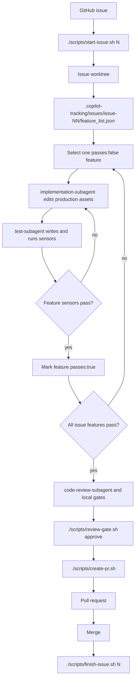

# Copilot Harness Lifecycle

This repository is a reusable harness for issue-driven Copilot work. The harness keeps the
project contract in GitHub Issues, the implementation isolated in per-issue worktrees, and the
agent steering loop grounded in local sensors.

## Lifecycle

The normal path is:

1. Create or pick a GitHub issue with concrete acceptance criteria and sensors.
2. Run `./scripts/start-issue.sh <N>` from the main checkout.
3. Work inside `../<repo>-worktrees/issue-NN`, not directly on the main checkout.
4. Populate or refine `.copilot-tracking/issues/issue-NN/feature_list.json`.
5. Pick one `passes:false` feature.
6. Use `implementation-subagent` for production assets only.
7. Use `test-subagent` for tests, smoke checks, and sensor execution.
8. Run local gates and `code-review-subagent` on the completed diff.
9. Run `./scripts/review-gate.sh approve` for the current HEAD.
10. Open the PR with `./scripts/create-pr.sh --title "..." --body-file body.md`.
11. Merge the PR when checks are green and findings are resolved.
12. Run `./scripts/finish-issue.sh <N>` from the main checkout.

All shell entrypoints live under `scripts/`. The repository root does not carry `.sh` entrypoints;
root-level copies are stale by definition and should be removed instead of documented.

## Copilot Roles

| Asset | Responsibility |
| --- | --- |
| `planning-subagent` | Researches the issue, reuses existing harness patterns first, and writes self-contained verifiable phases when planning is needed. |
| `implementation-subagent` | Implements one selected `feature_list` item by editing production assets only. It does not write tests or mark `passes:true`. |
| `test-subagent` | Writes or updates verification assets for one selected feature, runs declared sensors, and may mark `passes:true` only after checks pass. |
| `code-review-subagent` | Reviews spec compliance and quality, including security, brute-force patterns, duplication, over-design, dead-code risk, and docs drift. |
| `session-ritual.prompt.md` | A user-invoked prompt for resuming the coding-session ritual on a specific issue. |
| Skills under `.copilot/skills/` | On-demand review, PR, security, drift, and code-quality sensors used by the conductor and review workflow. |

The conductor remains responsible for selecting the issue and feature, preserving scope, approving the current HEAD,
committing, pushing, opening PRs, and merging.

## Local Tracking

`.copilot-tracking/` is gitignored local state. It is persistent on the developer machine but never pushed.

| Path | Purpose |
| --- | --- |
| `.copilot-tracking/issues/issue-NN/feature_list.json` | Per-issue feature breakdown, including `steps`, `passes`, `regression_sensor`, `e2e_sensor`, `blocked_on`, and `verification`. |
| `.copilot-tracking/issues/issue-NN/progress.md` | Running local log of completed features, verification, commits, and next work. |
| `.copilot-tracking/issues/issue-NN/plan.md` | Optional local implementation plan for non-trivial issue work. |
| `.copilot-tracking/plans/*.md` | Local planning-subagent output for deep plans. |
| `.copilot-tracking/review-gate/approved-head` | Local marker written by `./scripts/review-gate.sh approve`; must match current HEAD before `./scripts/create-pr.sh` opens a PR. |

## Gates And Sensors

`./scripts/init.sh` detects project surfaces and runs the matching local gates when present:

- docs-only: reports that no language gates are present and points agents to shellcheck/markdownlint for touched docs and scripts.
- Python: `uv sync --all-groups`, ruff format/check, mypy, and pytest.
- Go: `go test ./...` and `go vet ./...` when `go` is installed.
- Node/pnpm: `pnpm test` when a package test script exists and `pnpm` is installed.
- Terraform: `terraform fmt -check -recursive`, plus `terraform validate` when initialized.

Missing optional tools are explicit skips or warnings. Hard requirements such as `git`, `gh`, and GitHub auth remain
hard failures.

## Review Gate

`./scripts/review-gate.sh approve` records the current HEAD SHA in local gitignored state.
`./scripts/create-pr.sh` runs `./scripts/review-gate.sh check` before fetching, rebasing, pushing, or opening a PR.
Any new commit changes HEAD and requires a fresh review approval.

## Smoke CI Boundary

`.github/workflows/harness-smoke.yml` is intentionally small. It checks shell parsing, `shellcheck`, and Copilot
customization frontmatter. It is a remote harness-health sensor only.

It is not:

- CI/CD delivery.
- Azure deployment.
- A PR check watcher.
- A branch-protection required-check setup.
- Auto-merge or release automation.

Product repositories that adopt this harness can add their own CI/CD later, but that is outside this harness smoke
workflow.