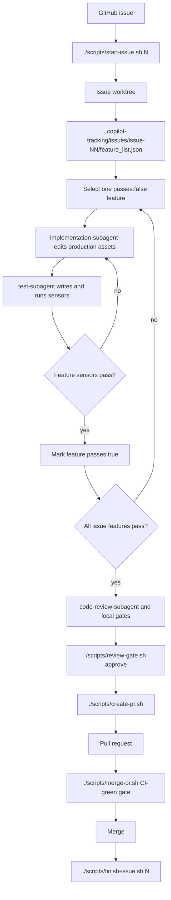

# Copilot Harness Lifecycle

This repository is a reusable harness for issue-driven Copilot work. The harness keeps the
project contract in GitHub Issues, the implementation isolated in per-issue worktrees, and the
agent steering loop grounded in local sensors.

For harness-enabled projects, the harness lifecycle is mandatory and stricter than generic Copilot or personal
workflow rules. If another instruction conflicts with this lifecycle, use the harness rule.

## Lifecycle

The normal path is:

1. Create or pick a GitHub issue with concrete acceptance criteria and sensors.
2. Run `./scripts/start-issue.sh <N>` from the main checkout.
3. Work inside `../<repo>-worktrees/issue-NN`, not directly on the main checkout.
4. Populate or refine `.copilot-tracking/issues/issue-NN/feature_list.json`.
5. Pick one `passes:false` feature.
6. Use `implementation-subagent` for production assets only.
7. Use `test-subagent` for tests, smoke checks, and sensor execution.
8. Run local gates and `code-review-subagent` on the completed diff.
9. Run `./scripts/review-gate.sh approve` for the current HEAD.
10. Open the PR with `./scripts/create-pr.sh --title "..." --body-file body.md`.
11. Merge the PR when checks are green and findings are resolved.
12. Run `./scripts/finish-issue.sh <N>` from the main checkout.

All shell entrypoints live under `scripts/`. The repository root does not carry `.sh` entrypoints;
root-level copies are stale by definition and should be removed instead of documented.

## Copilot Roles

| Asset | Responsibility |
| --- | --- |
| `planning-subagent` | Researches the issue, reuses existing harness patterns first, and writes self-contained verifiable phases when planning is needed. |
| `implementation-subagent` | Implements one selected `feature_list` item by editing production assets only. It does not write tests or mark `passes:true`. |
| `test-subagent` | Writes or updates verification assets for one selected feature, runs declared sensors, and may mark `passes:true` only after checks pass. |
| `code-review-subagent` | Reviews spec compliance and quality, including security, brute-force patterns, duplication, over-design, dead-code risk, and docs drift. |
| `session-ritual.prompt.md` | A user-invoked prompt for resuming the coding-session ritual on a specific issue. |
| Skills under `.copilot/skills/` | On-demand review, PR, security, drift, and code-quality sensors used by the conductor and review workflow. |

The conductor remains responsible for selecting the issue and feature, preserving scope, approving the current HEAD,
committing, pushing, opening PRs, and merging.

### The conductor must not do feature work itself (non-delegable)

When the issue workflow is active, the conductor **must not directly** write the feature's tests/sensors or its
production implementation, and must not flip `passes:true`. That feature work is **non-delegable** to the conductor:
it belongs to the subagents. The required per-feature handoff is:

1. **conductor selects** one `passes:false` feature and prepares context;
2. **`test-subagent` creates/validates the RED sensor** (a failing test/sensor that expresses the feature);
3. **`implementation-subagent` makes the minimal production change** to satisfy it;
4. **`test-subagent` verifies GREEN** and updates completion status (`passes:true`);
5. **conductor commits/pushes** and records the handbacks.

A progress log that only records **"conductor TDD"** is non-compliant — it hides this handoff. See
[harness.instructions.md §3](../.copilot/instructions/harness.instructions.md) for the enforceable rule.

When a handoff step fails, the conductor runs two **grading-driven revision loops** (it owns the loop boundary;
subagents never call each other). **Loop 1 (implementation ↔ test):** a production defect routes back to
`implementation-subagent`, a verification/sensor gap routes back to `test-subagent` (never weakening a declared
sensor). **Loop 2 (review → implementation):** a `code-review-subagent` `NEEDS_REVISION` routes each blocking finding
to `implementation-subagent`, `test-subagent`, or a conductor decision, then the relevant sensor and the review are
re-run on the new HEAD. The implementation-usefulness grade is a routing signal, not a severity override, and repeated
failure stops and asks the human after two attempts. Full protocol in
[harness.instructions.md §3](../.copilot/instructions/harness.instructions.md).

Conductor, implementation-subagent, test-subagent, and code-review-subagent actions must be visible in the issue
progress Action Log. Subagents preserve their role boundaries by reporting substantive actions back to the conductor
for logging when they are not authorized to edit local issue progress directly.

## Local Tracking

`.copilot-tracking/` is gitignored local state. It is persistent on the developer machine but never pushed.

| Path | Purpose |
| --- | --- |
| `.copilot-tracking/issues/issue-NN/feature_list.json` | Per-issue feature breakdown, including `steps`, `passes`, `regression_sensor`, `e2e_sensor`, `blocked_on`, and `verification`. |
| `.copilot-tracking/issues/issue-NN/progress.md` | Running local log of completed features, verification, commits, and next work. |
| `.copilot-tracking/issues/issue-NN/plan.md` | Optional local implementation plan for non-trivial issue work. |
| `.copilot-tracking/plans/*.md` | Local planning-subagent output for deep plans. |
| `.copilot-tracking/review-gate/approved-head` | Local marker written by `./scripts/review-gate.sh approve`; must match current HEAD before `./scripts/create-pr.sh` opens a PR. |

`progress.md` should include an Action Log section for substantive lifecycle actions, including conductor decisions,
subagent handbacks, verification results, review outcomes, and any deviation stop/report/recover entry.

`./scripts/check-feature-list.sh <N>` is a lightweight feature-list lifecycle guard. It validates that an issue's
`feature_list.json` is well formed — valid JSON object; every `.features[]` item has `id`, `title`, an array `steps`,
and a boolean `passes`; and any `passes:true` feature carries non-empty `verification` text — and reports completion
state. Incomplete (`passes:false`) features are a non-blocking warning by default and a hard failure under
`REQUIRE_FEATURES_COMPLETE=1`. `./scripts/finish-issue.sh` reuses this same check, so the two paths cannot drift. It
is deliberately generic: it does not read project docs, devcontainers, CI, or any sensor registry, and never executes
anything from the feature list.

## Gates And Sensors

`./scripts/init.sh` detects project surfaces and runs the matching local gates when present:

- docs-only: reports that no language gates are present and points agents to shellcheck for touched harness scripts. (markdownlint stays available as optional docs hygiene; it is not a required gate.)
- Python: `uv sync --all-groups`, ruff format/check, mypy, and pytest.
- Go: `go test ./...` and `go vet ./...` when `go` is installed.
- Node/pnpm: `pnpm test` when a package test script exists and `pnpm` is installed.
- Terraform: `terraform fmt -check -recursive`, plus `terraform validate` when initialized.

Missing optional tools are explicit skips or warnings. Hard requirements such as `git`, `gh`, and GitHub auth remain
hard failures.

markdownlint is treated as **optional** docs hygiene, not a required harness gate — markdownlint is not
part of the pre-commit, end-of-session, or pre-PR gates. The devcontainer pin for it is likewise optional
tooling, not a mandatory harness requirement. Run markdownlint ad hoc for optional Markdown style
feedback; a red markdownlint result never blocks issue work.

## Review Gate

`./scripts/review-gate.sh approve` records the current HEAD SHA in local gitignored state.
`./scripts/create-pr.sh` runs `./scripts/review-gate.sh check` before syncing, then checks again after
`git fetch origin main` + `git rebase origin/main` before pushing or opening a PR. Any new commit or rebase that
changes HEAD requires a fresh review approval for that final HEAD.

## CI Boundary

`.github/workflows/harness-smoke.yml` runs the harness shell sensor suite
(`tests/scripts/test_*.sh` and `tests/meta/test_*.sh`), checks shell parsing, runs `shellcheck`
over `scripts/` and `tests/`, and validates Copilot customization frontmatter. The runner is
`ubuntu-latest`, where `git`, `jq`, and `awk` are preinstalled; the tests fake every external CLI,
so the suite needs no secrets and runs on fork PRs.

A green run is a **hard precondition for merge**: merge through `./scripts/merge-pr.sh`, which
verifies `gh pr checks` is green before merging. For belt-and-braces enforcement, a repo admin
should enable a **branch-protection required check** on `main` so the gate cannot be bypassed.

It is still not:

- CI/CD delivery.
- Azure deployment.
- Auto-merge or release automation.

Product repositories that adopt this harness can add their own CI/CD later, but that is outside this harness
workflow.