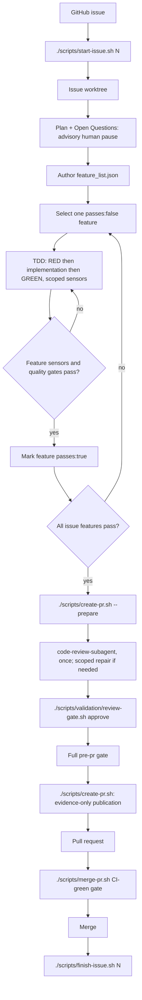

# Copilot Harness Lifecycle

This repository is a reusable harness for issue-driven Copilot work. The harness keeps the
project contract in GitHub Issues, the implementation isolated in per-issue worktrees, and the
agent steering loop grounded in local sensors.

For harness-enabled projects, the harness lifecycle is mandatory and stricter than generic Copilot or personal
workflow rules. If another instruction conflicts with this lifecycle, use the harness rule.

## Harness Layers

The harness is organized in three layers so that stable lifecycle behavior stays
separate from replaceable language support and project-specific conventions:

- **Core Harness** — the language-neutral lifecycle: preflight, per-issue
  worktrees, local progress tracking, the review gate, and PR closeout. Its
  behavior is frozen in the machine-readable contract
  [docs/harness-contract.yml](harness-contract.yml) and guarded by
  `tests/scripts/test_harness_contract.sh`. The owner scripts
  (`scripts/lib/issue-lib.sh`, `scripts/lib/trace-lib.sh`,
  `scripts/start-issue.sh`, `scripts/validation/check-feature-list.sh`,
  `scripts/validation/review-gate.sh`, `scripts/create-pr.sh`,
  `scripts/merge-pr.sh`, `scripts/finish-issue.sh`) must stay
  language-neutral. The `scripts/` language & structure policy — what stays
  bash, what may become Python (trigger-based), and the split thresholds — is
  recorded in
  [the upstream contributor policy](https://github.com/weijen/agent-delivery-harness/blob/main/docs/scripts-language-policy.md).
- **Language Profiles** — declarative descriptors in `profiles/<id>.profile.sh`
  that supply surface labels, dependency sync, and gate commands after
  `init.sh`'s explicit marker checks select a project surface. The
  shipped set is **Python and Node.js** (proven adopters); **Go, Java, and Ruby**
  are generator-supported — regenerate them on demand with
  `scaffold-language.sh`. The lifecycle core stays language-neutral, while the
  current preflight enumerates marker files and loads the matching profile. See
  [profiles/README.md](../profiles/README.md) for the descriptor contract and
  [docs/multi-language-profiles.md](multi-language-profiles.md) for the design.
- **Framework Templates** — project-specific conventions layered on top of a
  profile (e.g. FastAPI/Django for Python, Spring Boot/Quarkus for Java). These
  live in the adopting project's own docs and instruction files, never in the
  core. A profile only declares framework *hints*; it never forces a framework.

### Adding or updating a language profile

Use the generator rather than hand-copying assets:

```sh
./scripts/scaffold-language.sh <python|go|node|java|ruby>          # dry run
./scripts/scaffold-language.sh <profile> --write                  # create missing assets
./scripts/scaffold-language.sh <profile> --update                 # overwrite a differing asset (after showing the diff)
```

The generator is idempotent and conservative: it refuses unknown profiles, does
not overwrite project-specific files without `--write`, creates or updates the
matching `.copilot/instructions/<language>.instructions.md`, reports the gates the
profile adds to `init.sh`, and leaves the issue / worktree / review-gate scripts
untouched. After adding a profile, add a `tests/scripts/test_<id>_profile.sh`
regression sensor and extend the multi-surface `tests/scripts/test_init_gates.sh`
e2e fixture so the new surface is exercised.

### Non-regression contract

The frozen lifecycle in [docs/harness-contract.yml](harness-contract.yml) is the
single source of truth for Core Harness behavior. Before changing any lifecycle
script, keep these sensors green:

- `tests/scripts/test_harness_contract.sh` — scripts still satisfy the contract
  (required scripts exist and parse; the four gates, SHA bindings, audited
  bypasses, and environment flags still match their owners; owner scripts stay
  language-neutral).
- `tests/scripts/test_init_gates.sh` — `init.sh` still detects every surface and
  runs the matching gates.

The full sensor suite (`test_*.sh` recursively under `tests/scripts/` and
`tests/meta/`, excluding `lib/`, `helpers/` and `fixtures/` subtrees) runs
in CI and is a hard precondition for merge (see [CI Boundary](#ci-boundary)).
The local runner and both workflow profiles share
`scripts/validation/affected-sensors.sh --list` discovery. Empty full suites fail; empty
scoped selections remain valid.
Affected resolution selects from that same sensor set, including relocated
sensors but never helpers. Feature greens require an explicit fixed feature
base: record `git rev-parse HEAD` before the first edit, then use that SHA for
every green of that feature, including after partial commits. Earlier completed
features do not remain in scope just because the branch still differs from main.
Shared libraries and schema/contract authorities use the same scoped mapping,
not a FULL fallback. Discovery/read errors and invalid declarations stop the run.

Real source, installed-profile and L0 whole-suite wrappers declare
`# harness-sensor-stage: boundary` in their leading comment header. They remain
in full discovery for final pre-PR and CI, but are deferred from feature
selection. Declaring one as feature coverage fails explicitly rather than
silently dropping it. Feature greens retain targeted runtime e2e and miniature
hermetic fixtures that exercise full-runner behavior. This stage separation
does not remove assertions or authorize reusing boundary-gate evidence.

### Sensor diagnostics

Each nonempty local runner invocation prints a `DIAGNOSTICS <index>` location
and a `SENSOR <path> elapsed_ms=<n> exit_status=<n> log=<path>` record per
attempt. Existing `PASS`/`FAIL` and final `SENSORS` lines retain their meaning.
The index is tab-separated: sensor, elapsed_ms, actual exit_status, log.
Adjacent `run.tsv` records HEAD, mode and scope; a unique run directory prevents
repeated attempts from overwriting each other. Elapsed wall time includes
output capture/redaction, not just CPU execution; it is never a pass threshold.

Logs are sanitized before writing and retained beneath the main checkout's
ignored `.copilot-tracking/issues/issue-NN/sensor-runs/` directory, surviving
issue-worktree removal. Without issue context they use
`.copilot-tracking/sensor-runs/`. Run directories are private (0700).
Credential-shaped quoted lines and multiline private keys are withheld;
other known secret shapes use the shared trace redactor. Redaction is not a
license to print arbitrary sensitive data: sensors must not dump environments,
customer data or credentials. Diagnostics remain local, never commit/upload them
without a separate exposure check.

Storage/redaction failures print explicit warnings and `log=unavailable`.
The runner drains discarded output without rerunning the sensor or substituting
a capture exit code for the sensor's exit. The gate still reflects sensor results;
a failing sensor never creates green evidence. Diagnostic indexes are not gate
evidence and cannot authorize publication. Existing CI execution loops are unchanged.

On failure, the runner prints the first and last ten sanitized lines (at most
200 bytes per displayed line), with an omission marker when necessary. This
preserves early causes and final assertions without flooding the terminal.
The retained log remains complete; successful output is retained but not dumped.
Diagnostics never execute a sensor a second time.

Use the exact index path printed by the run, from any working directory:

```sh
index="/path/printed/by/DIAGNOSTICS/sensors.tsv"
# Slowest attempted sensors, descending elapsed_ms.
tail -n +2 "$index" | sort -t "$(printf '\t')" -k2,2nr | sed -n '1,10p'
# Failed attempts and their complete sanitized output paths.
awk -F '\t' 'NR > 1 && $3 != 0 { print $1, "exit=" $3, "log=" $4 }' "$index"
```

Timing overhead is workload- and machine-dependent. Measure paired miniature
fixtures when changing instrumentation; do not run extra real full suites just
to benchmark it. A run's elapsed values include any nested work the sensor does;
they do not count or attribute its individual assertions.

## Lifecycle


```mermaid
flowchart TD
  A[GitHub issue] --> B[./scripts/start-issue.sh N]
  B --> C[Issue worktree]
  C --> HG[Plan + Open Questions: advisory human pause]
  HG --> D[Author feature_list.json]
  D --> E[Select one passes:false feature]
  E --> F[TDD: RED then implementation then GREEN, scoped sensors]
  F --> H{Feature sensors and quality gates pass?}
  H -- no --> F
  H -- yes --> I[Mark feature passes:true]
  I --> J{All issue features pass?}
  J -- no --> E
  J -- yes --> S[./scripts/create-pr.sh --prepare]
  S --> K[code-review-subagent, once; scoped repair if needed]
  K --> L[./scripts/validation/review-gate.sh approve]
  L --> V[Full pre-pr gate]
  V --> M[./scripts/create-pr.sh: evidence-only publication]
  M --> N[Pull request]
  N --> Q[./scripts/merge-pr.sh CI-green gate]
  Q --> O[Merge]
  O --> P[./scripts/finish-issue.sh N]
```

The normal path is:

1. Create or pick a GitHub issue with concrete acceptance criteria and sensors.
2. Run `./scripts/start-issue.sh <N>` from the main checkout.
3. Work inside `<repo>/.worktrees/issue-NN`, not directly on the main checkout.
   Keeping worktrees under the repository trust boundary avoids sibling-path
   sandbox denials. During migration, lifecycle scripts still resolve an
   already-existing sibling `<repo>-worktrees/issue-NN` worktree.
4. Plan the issue in `.copilot-tracking/issues/issue-NN/plan.md`, surface Open Questions for the
   **advisory human pause**, then author `feature_list.json` from the confirmed plan (each feature
   carrying its `regression_sensor` / `e2e_sensor`). See
   [The breakdown flow](#the-breakdown-flow-plan--clarify--feature_list).
5. Pick one `passes:false` feature.
6. Deliver it yourself with TDD — RED sensor, minimal production implementation, GREEN verified
   with scoped sensors (`./scripts/run-sensors.sh green`), record any `deviation`
   spans, and flip `passes:true` (#352: one agent, no handback choreography).
7. Repeat until all features pass.
8. Run `./scripts/create-pr.sh --prepare`, then
   `code-review-subagent` on the completed diff using recorded scoped feature evidence.
   Do not run a full suite before review. The reviewer applies the product-quality scorecard during review before closeout, following
  [docs/product-quality-rubric.md](product-quality-rubric.md), and performs an
  adversarial test-quality pass before closeout. It may add and execute the smallest independent test, fixture,
  smoke, or validation asset needed, but production remains read-only and the reviewer must not edit it.
9. Run `./scripts/validation/review-gate.sh approve` for the current HEAD.
10. Run `./scripts/run-sensors.sh --gate pre-pr`, then open the PR with
    `./scripts/create-pr.sh --title "..." --body-file body.md` without further tests or synchronization.
11. Merge the PR when checks are green and findings are resolved.
12. Run `./scripts/finish-issue.sh <N>` from the main checkout.

All shell entrypoints live under `scripts/`. The repository root does not carry `.sh` entrypoints;
root-level copies are stale by definition and should be removed instead of documented.

### The breakdown flow (plan → clarify → feature_list)

Who turns the issue into `feature_list.json`, and when, is fixed — the breakdown
is never authored before a plan exists, and never while a human still owes a
decision:

1. **Plan and surface decisions.** Research the issue, write the plan in
   `.copilot-tracking/issues/issue-NN/plan.md`, and list an explicit **Open Questions /
   Needs-Human-Input** section.
2. **Pause for human input (advisory).** Relay open questions to the human and pause while any
   is unresolved. This pause is doctrine, not a mechanical gate — the contract's `gate_start`
   does not enforce it (#424 aligned prose with the contract).
3. **Author the breakdown.** Once the human resolves the questions, author `feature_list.json`
   from the confirmed plan, each feature carrying its `regression_sensor` / `e2e_sensor`. The
   2–5-feature sizing cap (STOP and propose a split above 5) is single-sourced in
   `harness.instructions.md` §3 step 1.
4. **The GitHub issue stays the contract; `feature_list.json` is the derived breakdown.**

This keeps decisions that need a human in front of the human *before* any breakdown is
committed (#352: one agent owns plan, breakdown, and delivery).

#### What counts as one feature

When authoring the breakdown in step 3, granularity is fixed by one rule (the
authority is the *What counts as one feature* subsection in
[.copilot/instructions/harness.instructions.md](../.copilot/instructions/harness.instructions.md)):
a feature is one externally observable acceptance criterion provable by **exactly one**
`regression_sensor` (plus an `e2e_sensor` when it crosses a real runtime boundary). **Split** a
candidate when it needs more than one independent sensor or mixes more than one concern; **merge**
two candidates when they share a single sensor and cannot be verified independently. The sensor is
the unit — every `feature_list` item names exactly one `regression_sensor`, and no two items share
one.

## Agent Topology (#352: one agent + one reviewer)

The lifecycle is delivered by **one agent in one continuous context** per issue. It plans,
authors the breakdown, implements with TDD, runs scoped sensors, records its own
`deviation` spans, and drives the boundary scripts. The **only other model
invocation** is `code-review-subagent` — invoked once, pre-PR, over the whole branch diff, in a
fresh context with no visibility into the delivery conversation (that independence is what made
it the harness's most effective defect catcher). `repair`-mode re-reviews after a
`NEEDS_REVISION` are scoped to the revised features. If the runner does not register the
`code-review-subagent` agent name from its `.agent.md` file, the fallback is unchanged: invoke a
fresh (blank/current) subagent and paste the full role contract from the agent file.

The retired conductor/generator/planning role choreography (late-2025 pattern) and its handback
payload protocol are documented in git history; historical traces carrying those role names
remain valid.

## Local Tracking

`.copilot-tracking/` is gitignored local state. It is persistent on the developer machine but never pushed.

During an active issue, the artifacts are deliberately split between checkouts:

- `trace.jsonl` lives under `.copilot-tracking/issues/issue-NN/` in the **main checkout**.
- `feature_list.json`, `plan.md`, and `progress.md` live under the same relative path in the
  **issue worktree**.

Do not look for either group in the other location. Closeout migrates the finalized
`progress.md` to the main checkout before removing the worktree, as described below.

| Path | Purpose |
| --- | --- |
| `.copilot-tracking/issues/issue-NN/feature_list.json` | Per-issue feature breakdown, including `steps`, `passes`, `regression_sensor`, `e2e_sensor`, `blocked_on`, `verification`, and (#449) `type`/`finding_fingerprint` on repair items. Historical lists may still carry the retired `teeth_proof` field (#334) — valid to read, never authored anew. |
| `.copilot-tracking/issues/issue-NN/progress.md` | Running local log of completed features, verification, commits, and next work. |
| `.copilot-tracking/issues/issue-NN/plan.md` | Optional local implementation plan for non-trivial issue work. |
| `.copilot-tracking/plans/*.md` | Local deep-plan documents (multi-issue runs, prompts). |
| `.copilot-tracking/review-gate/issue-NN/approved-head` (issue-scoped; the un-scoped `review-gate/approved-head` survives only as a read-only legacy fallback) | Local marker written by `./scripts/validation/review-gate.sh approve`; must match current HEAD before `./scripts/create-pr.sh` opens a PR. |

`progress.md` includes an Action Log section rendered from trace spans (#332), covering substantive lifecycle actions,
subagent handbacks, verification results, review outcomes, and any deviation stop/report/recover entry.

While an issue is open, the **worktree** copy of `progress.md` is authoritative: `scripts/log-handback.sh` writes
each Action Log line there (see Trace emission below). Before migration,
`./scripts/finish-issue.sh` atomically replaces its first in-flight `Status:`
line with a write-once `Conclusion:` containing `merged` or `abandoned` and the
latest trace-derived review verdict (`APPROVED`, `NEEDS_REVISION`, or `n-a`).
A merged conclusion requires a merged GitHub PR whose head is the exact issue
branch; abandonment requires explicit `ABANDONED=1`. An identical conclusion is
idempotent, while a conflicting conclusion is never overwritten.

`./scripts/finish-issue.sh` then migrates that worktree `progress.md` before `git worktree remove`.
Its `progress_migrate` stage calls `best_effort_progress_migrate` (`scripts/lib/finish-lib.sh`) to copy the file verbatim
into the issue's tracking directory at the **main checkout** root. This mirrors `trace.jsonl`'s survival rationale — a linked worktree is
deleted by teardown, so the migrated main-root `progress.md` survives it the same way `trace.jsonl` does, staying
available for the post-hoc `check-trace-consistency.sh` audit. The copy helper
is failure-atomic and independently warn-only, but closeout treats a missing,
unsafe, unwritable, or failed migration as a hard pre-teardown block. This
prevents worktree removal from destroying the only finalized record.

`scripts/lib/economics-report-lib.sh` retains sourceable helpers that can stamp a **delivery economics** block into an
issue `progress.md` (between `<!-- delivery-economics:start -->` / `<!-- delivery-economics:end -->` markers,
idempotently) from the issue trace and `feature_list.json`. No lifecycle entrypoint invokes these helpers after
the trace reporter's retirement in #419. When invoked directly, the block reports wall-clock span as both
first→last elapsed time and active time (the sum of chronologically adjacent gaps up to and including 30 minutes;
gaps over 30 minutes are excluded in full), token totals with run coverage, review rounds, deviations logged, and feature counts (passes:true). Every row obeys the **omit-never-fake / null-never-0** rule: a metric that was not actually
measured is **omitted entirely** and never fabricated as `0` or a half-present `n/a` placeholder. In particular the
trace-derived token row appears only when a runtime adapter reported `gen_ai.usage.*` on model spans; otherwise it is
omitted — issue #329 retired the old `- Tokens: n/a` line, because a half-present field is worse than an absent one.
These report-time computations and stamps live in
`scripts/lib/economics-report-lib.sh`; `scripts/lib/finish-lib.sh` remains limited to
migration, closeout gates, finalization, teardown orchestration, and state
hygiene.

**Native-record economics join (issue #329).** Because the GitHub Copilot runtime does not carry `gen_ai.usage.*` on
model spans, the helper can also join real token/model economics from the local Copilot **native session records** at
`${COPILOT_CLI_STATE_ROOT:-~/.copilot/session-state}/<COPILOT_AGENT_SESSION_ID>/events.jsonl`, rendered as a clearly
labelled second economics block. Only honest derived aggregates cross into the record, never raw event content: a
**subagent-only** token total (the single `totalTokens` per `subagent.completed` event — never split into a fabricated
input/output pair, and excluding the top-level session), the distinct subagent **model** names with per-model
counts/tokens, and the subagent tool-call and duration sums. A `subagent.completed` record is aggregated **only** when
all four required economics fields are genuinely present with correct types (a non-empty string `model` and
non-negative numeric `totalTokens`/`totalToolCalls`/`durationMs`); an incomplete or malformed record is **excluded
whole**, never mapped to an `unknown` model or a fabricated `0`. The field-presence check is about type/presence, not
content sanity, so a `model` label — untrusted local text — is rendered through a display-only **sanitization**
boundary (`sanitize_model` inside `render_native_economics`): every C0 control character (including CR/LF) is
stripped to a space, runs collapse, ends trim, and the visible label is capped at 60 characters with a `…` marker.
This keeps the markdown block bounded, single-line, and safe against the `<!-- delivery-economics:start/end -->`
markers `economics_stamp_into` matches by exact line equality, while the honest join/grouping in
`compute_native_economics` keeps aggregating on the **raw** model string — cardinality and totals are unaffected by
this rendering-time transform. The join is **windowed** by the issue trace's own
first→last timestamp, so events from other issues in a long shared session are excluded. **AIU** is a windowed delta
of the cumulative `session.usage_checkpoint` / `session.compaction_complete` `totalNanoAiu` counter, emitted **only**
when a checkpoint at/before the window start gives a baseline, at least one checkpoint inside the window shows
movement, AND the window-end value has not decreased below the baseline; a decrease (session reset/rollback) omits the
field entirely (never a negative, never a masked `0`), while an equal value is a genuinely measured zero. When the
session id, the events file, `jq`, the window, or a
field is unavailable (CI, adopter machines), every native field/row **fails open and is omitted** — never zeroed,
never `n/a`. This native-record join **supersedes** the cloud token-capture approach tracked in **#163** (per the #305
direction): #163 is no longer the prerequisite for non-`n/a` token rows but the complementary cloud-side path the local
join now stands in for. The frozen `trace-summary.json` contract remains historical; no current lifecycle entrypoint
generates or aggregates those summaries.

A review round is a distinct logical review event, not a per-feature `review_verdict` span. Events are keyed by
`harness.review_event_id` when present; historical spans without an explicit ID fall back to
`(harness.reviewed_sha, harness.review_mode)`. All verdicts sharing one key form one event, and one failing child
makes the event fail. If any verdict lacks valid and unambiguous event identity — it carries no explicit
`review_event_id`, no valid SHA/mode pair, or has legacy coordinates shared by multiple explicit-ID events — the
Markdown count is `n/a` with identity coverage and the numeric count is omitted with matching coverage fields; no
verdict spans remains a measured `0`. Mixed traces (some explicit IDs, some legacy SHA/mode) use unambiguous bridge
semantics: a legacy span whose coordinates match exactly one explicit event bridges to that event (same logical
event, no double-count); pure legacy coordinates with no matching explicit-ID span retain the SHA/mode fallback;
legacy coordinates shared by multiple explicit-ID events are ambiguous and render the round count `n/a` with the
numeric count omitted.

`./scripts/validation/check-feature-list.sh <N>` is a lightweight feature-list lifecycle guard. It validates that an issue's
`feature_list.json` is well formed — valid JSON object; every `.features[]` item has `id`, `title`, an array `steps`,
and a boolean `passes`; and any `passes:true` feature carries non-empty `verification` text — and reports completion
state. Incomplete (`passes:false`) features are a non-blocking warning by default and a hard failure under
`REQUIRE_FEATURES_COMPLETE=1`. `./scripts/finish-issue.sh` reuses this same check, so the two paths cannot drift. It
is deliberately generic: it does not read project docs, devcontainers, CI, or any sensor registry, and never executes
anything from the feature list.

### Durable class lessons

A successful escalated class repair (see the Same-Class Escalation doctrine) appends a one- or
two-line durable lesson to `AGENTS.md` or a `.copilot/instructions/*.instructions.md` file; the
trace carries only the path and one-line summary of that lesson, never its body.

## Gates And Sensors

`./scripts/init.sh` detects project surfaces with explicit marker-file branches.
For each detected language, `profiles/<id>.profile.sh` supplies the surface
label, dependency sync, and local gate commands:

- docs-only: reports that no language gates are present and points agents to shellcheck for touched harness scripts. (markdownlint stays available as optional docs hygiene; it is not a required gate.)
- Python (`pyproject.toml`): `uv sync --all-groups`, ruff format/check, mypy, and pytest.
- Go (scaffold skeleton; `go.mod`): `gofmt -l`, `go vet ./...`, optional golangci-lint, and `go test ./...`.
- Node.js (`package.json`): prettier, eslint, optional tsc, and the project's test script — pnpm when the project declares it, otherwise npm.
- Java (scaffold skeleton; `pom.xml`, `build.gradle`, or `build.gradle.kts`): optional Spotless and Checkstyle/PMD/SpotBugs, plus the test task — Maven or Gradle, preferring `./mvnw`/`./gradlew` wrappers.
- Ruby (scaffold skeleton; `Gemfile`): standardrb or RuboCop and RSpec or Minitest, plus a typecheck gate only when Sorbet/Steep is configured.
- Terraform: `terraform fmt -check -recursive`, plus `terraform validate` when initialized.

Missing optional tools are explicit skips or warnings. Hard requirements such as `git`, `gh`, and GitHub auth remain
hard failures.

markdownlint is treated as **optional** docs hygiene, not a required harness gate — markdownlint is not
part of the pre-commit, end-of-session, or pre-PR gates. The devcontainer pin for it is likewise optional
tooling, not a mandatory harness requirement. Run markdownlint ad hoc for optional Markdown style
feedback; a red markdownlint result never blocks issue work.

### Trace emission

Every lifecycle script (`start-issue.sh`, `check-feature-list.sh`, `review-gate.sh`, `create-pr.sh`,
`merge-pr.sh`, `finish-issue.sh`) emits schema-v1 trace spans via `scripts/lib/trace-lib.sh` to the per-issue trace
file `.copilot-tracking/issues/issue-NN/trace.jsonl` at the **main checkout** root — one append-only file per
issue regardless of which worktree a script runs from, so the record survives worktree teardown. The trace is
local-only, gitignored, and never committed. Tracing never blocks the lifecycle: every trace failure — including
a missing `trace-lib.sh` — is a warn-and-continue no-op. The span vocabulary and shape are frozen by the schema
contract in `docs/observability-and-trace-schema.md` (`schemas/trace-schema.v1.json`).

The retired trace reporter no longer generates `trace-summary.json`, version-bucket aggregates, or
`finish-issue.economics` tool spans. The frozen summary schema and sourceable economics helpers remain for historical
compatibility, but they are outside the lifecycle and make no closeout claim.

Conductor decisions and subagent handbacks are recorded as **agent spans** through `scripts/log-handback.sh`: the
delivering agent runs it once per recorded event (single-source), and that single invocation writes the agent span to
`trace.jsonl` — the canonical record. The `## Action Log` section in `progress.md` is **rendered** from those
spans by `scripts/render-action-log.sh` (which log-handback.sh calls after span emission), so the trace is the
single source of truth and the Action Log is a human-readable view derived from it. Never hand-author the span or
the Action Log line separately; always use `scripts/log-handback.sh` so the canonical span and the rendered view
stay in step. Full conventions (roles, lifecycle steps, deviation recording, token-usage omit-never-fake rule)
live in [harness.instructions.md §3](../.copilot/instructions/harness.instructions.md).

The harness emits lifecycle and handback spans itself. Deep GitHub Copilot
tool/model/skill analysis reads native records through the path documented in
[runtime-adapters/github-copilot.md](github-copilot.md); the
Claude Code adapter ([optional upstream guide](https://github.com/weijen/agent-delivery-harness/blob/main/optional/runtime-adapters/claude-code.md))
remains a labeled reference example.

The trace record is itself audited by the **trace gate** (`./scripts/validation/review-gate.sh trace`): it wraps the
report-only `check-trace-consistency.sh` checker — which now also owns the schema/type/redaction validation
folded from the retired `validate-trace.sh` (issue #335) — and emits one `review-gate.trace` tool span per run
with numeric finding counts. The retired log_without_span / span_without_log Action-Log reconciliation was
removed in issue #332; `progress.md` is still read for the retained `pr_mismatch` and
`finished_with_inflight_status` gates. The checker is live on real runs: in issue-number mode it reads the
main-root trace and falls back to the invoking worktree's toplevel tracking dir for `progress.md` /
`feature_list.json` (where the start-issue scaffold writes them) when the main-root copies are absent.

## Review Gate

Before final review and full pre-PR validation, run
`./scripts/create-pr.sh --prepare` to fetch and synchronize with main. Preparation
does not require an approval, execute sensors, push, or open a PR. It aborts
conflicts without publishing; `CREATE_PR_NO_REWRITE=1` retains history through a
merge instead of a rebase. Review and validate the resulting HEAD, not the
candidate that existed before synchronization.

`./scripts/validation/review-gate.sh approve` records the current HEAD SHA in local gitignored state
without running sensors. After review and repairs, explicitly run the final
`./scripts/run-sensors.sh --gate pre-pr` once on the successful unchanged candidate.
If that gate fails, repair with scoped checks, obtain relevant re-review, then
run it again on the repaired final candidate; a failed attempt is never green evidence.
Normal `./scripts/create-pr.sh` checks that approval and verifies a successful,
full, nonempty `pre-pr` evidence row for the same HEAD. Missing, stale, malformed,
tampered, wrong-mode or wrong-scope evidence stops publication with a diagnostic.
It never runs sensors, fetches main, rebases or merges during publication.
Historical pre-review evidence remains readable but cannot replace final pre-PR
evidence. New `--gate pre-review` execution is rejected with migration guidance.

The published source is pinned to the verified commit. Later main changes do not
trigger another local rewrite/test cycle inside the wrapper; remote PR CI owns
integration testing. Existing green checks are not a guarantee that every later
base update was tested: current-CI freshness enforcement is a separate follow-up
(#485), not a claim made by this local optimization.

**Push contract.** `--force-with-lease` in `create-pr.sh` applies only to the run's own single-writer
feature branch — the one the issue's worktree owns exclusively — and never to `main` or any shared branch
(the on-`main` refusal at the top of the script enforces this structurally). Rebase onto `origin/main`
remains the default for explicit preparation; `CREATE_PR_NO_REWRITE=1` instead
merges during preparation and uses a plain push during publication. A remote
force-policy rejection stops without resetting or rewriting the verified
candidate. A fast-forward can retry with that non-rewriting flag; otherwise,
prepare a history-preserving candidate explicitly and repeat its review/full
pre-PR obligations. Authentication, network and content-policy rejections remain
loud failures, never a reason to silently change the candidate.

`review-gate.sh check` (and `finish-issue.sh`, before worktree teardown) additionally runs the trace gate
(`review-gate.sh trace`) **warn-only**: findings from the trace validator and the cross-artifact consistency checker
are printed with a `⚠` summary but do not change the exit code — live traces predating the current doctrine would
otherwise fail every in-flight run. Setting `REQUIRE_TRACE_CONSISTENCY=1` (the documented promotion flag, mirroring
`REQUIRE_FEATURES_COMPLETE`) turns findings into a hard failure: `check` exits non-zero and `finish-issue.sh` refuses
before `worktree remove`, leaving the worktree intact.

The log-completeness gate (`review-gate.sh log-completeness`) scans the per-issue Action Log `progress.md` for known
placeholder signatures that should be filled before closeout: `Recorded on completion below`, `TBD`, and
`TODO(fill`. Ordinary `review-gate.sh check` and `review-gate.sh log-completeness` use remains WARN-ONLY by default;
setting `REQUIRE_LOG_COMPLETE=1` promotes findings to a hard block. Destructive `finish-issue.sh` is stricter:
after atomically migrating `progress.md`, it atomically removes only the exact placeholder bullet and guidance
paragraph emitted by `start-issue.sh`, then always applies the shared log-completeness gate in blocking mode before
writing the terminal conclusion or removing the worktree. Any residual signature therefore leaves the worktree
intact and the durable record without a conclusion. `LOG_COMPLETENESS_PATHS` may replace the default scan target
with a whitespace-separated list of `NN` path templates. Each resolved run emits a
`review-gate.log-completeness` trace span with numeric `harness.finding_count`.

### Sensor teeth-proof obligation (retired, #334)

The teeth-proof evidence machinery (retired, #334) — the `teeth_proof` object (retired), the red-first ordered-triple check, and the
`teeth_proof_missing` PR block (all retired) — is gone. Measured yield across real runs was zero (every real catch came
from the independent end-of-issue review), while the ceremony taxed every green. TDD remains the working
discipline; test quality is judged by the review. Historical feature lists carrying `teeth_proof`,
`teeth_proof_waiver`, or `red_first_waiver` (all retired) stay valid because the validator treats those fields as
inert metadata. The `feature_start` selection-evidence gate is also retired (#370); historical spans
remain schema-valid.

## CI Boundary

`.github/workflows/harness-smoke.yml` runs the harness shell sensor suite
(the same recursive discovery used by the local runner), checks shell parsing, runs `shellcheck`
through `scripts/validation/check-shell.sh`, and validates Copilot customization frontmatter.
The shared shell gate recursively covers scripts, profiles, sensor/library trees,
eval tools and available optional adapters, excluding fixture subtrees. Syntax
parses each file separately; lint consumes the same unique file set. The runner is
`ubuntu-latest`, where `git`, `jq`, and `awk` are preinstalled; the tests fake every external CLI,
so the suite needs no secrets and runs on fork PRs.

Both installed profiles select [the adopter workflow](../profiles/adopter-smoke.yml)
for that destination. Only the source repository retains the maintainer workflow,
including Python profile, tombstone-history and L0 gates. Portable developer
installations additionally provide `bash tests/evals/bin/run-l0-suite.sh`
for explicit evaluation runs.
Adopters supply their own application CI; the core smoke job does not assume
the harness maintainer's language environment or release history.

### Platform parity and verification authority

A green local sensor run on macOS is **advisory**, not proof that the same commands
will pass on the Ubuntu runner. The merge-time CI result is authoritative because
shell utilities and Git behavior vary by operating system and version.

The worked example is a script using `set -euo pipefail` and
`git log --reverse | head -1`. It stayed green on macOS but exited 141 on Ubuntu
with Git 2.34.1: `head` exited after its first line, the still-writing `git log`
received `SIGPIPE`, and `pipefail` surfaced that failure. Avoid early-exit
consumers over unbounded producer output; capture the complete output first or use
an operation that consumes the full stream.

When local and CI results differ, check known platform divergences before treating
the failure as unrelated or flaky:

- pipelines whose consumer exits early, especially `head` and `grep -m` under `pipefail`;
- BSD versus GNU `sed -i` syntax;
- `date` flags and output formats;
- `mktemp` templates and option support;
- locale- or implementation-dependent `sort` behavior;
- Git version-specific command and pipeline behavior.

A green run is a **hard precondition for merge**: merge through `./scripts/merge-pr.sh --squash --delete-branch` (a method flag is required non-interactively), which
verifies `gh pr checks` is green before merging. For belt-and-braces enforcement, a repo admin
should enable a **branch-protection required check** on `main` so the gate cannot be bypassed.

**Merge covenant + provenance audit (#460).** Raw `gh pr merge` is never the sanctioned path.
Real runs showed that under pressure (a CI bootstrap deadlock) admin merges over red required
checks happened silently — so the trace checker reconciles `main` against the trace: opt in by
committing a full main SHA to `config/harness/merge-audit-base`, and `check-trace-consistency.sh`
warns (`merge_provenance_gap <sha>`, counted, warn-only, never blocking) for every first-parent
commit after that baseline that no `pr_merge` pass span and no `deviation` span references. The
sanctioned emergency procedure is: write a `log-handback.sh conductor deviation` span naming the
reason and ≥ 12 chars of the SHA (before the merge, or retroactively — either clears the
warning), then merge. Out-of-band merging is tolerated under necessity; being invisible is not.

### Project-CI coverage gate

`harness-smoke.yml` owns the harness sensors and may also own a project profile gate explicitly.
It counts as project-CI coverage only for a profile whose `PROFILE_CI_SIGNATURES` command appears
in that workflow; unrelated harness steps never imply coverage. A repo that ships another code
surface (Python/Go/Node/Java/Ruby) must add that profile gate to an existing workflow or create a
separate project workflow. The harness makes a missing project CI visible early and blocking at
PR time:

- **Preflight WARN** — `./scripts/init.sh` warns when a code surface is present but no
  `.github/workflows/*.y*ml` references that surface's gate commands. Seen at the first
  `start-issue`.
- **Pre-PR fail-closed `ci-gate`** — `./scripts/validation/review-gate.sh ci-gate` (run inside
  `review-gate.sh check`, so `./scripts/create-pr.sh` enforces it with no extra step) refuses to
  open a PR under the same condition. The documented escape hatch is `SKIP_CI_GATE=1`, which
  bypasses the gate with a **logged** warning for a repo that legitimately has no project CI yet.

Detection signatures live in each `profiles/<id>.profile.sh` (`PROFILE_CI_SIGNATURES`); the
language-neutral gate scripts read them through `scripts/lib/ci-coverage-lib.sh`, so `review-gate.sh`
and `create-pr.sh` stay free of any language token.

It is still not:

- CI/CD delivery.
- Azure deployment.
- Auto-merge or release automation.

Product repositories that adopt this harness can add their own CI/CD later, but that is outside this harness
workflow.

## Harness Versioning & Releases

The top-level `VERSION` file is the authoritative **SemVer** release identity for the harness. It is the source of
truth that `scripts/lib/trace-lib.sh` reads for the `harness.version` stamped on every trace span; the exact commit
behind that release is carried separately by the optional `harness.commit` field (the short git SHA of the harness
scripts at emit time).

Bumping `VERSION` is **automated** (#257): python-semantic-release computes the next SemVer from the
Conventional Commits landed on `main`, writes `pyproject.toml [project].version` (the single source of
truth), mirrors it into `VERSION` via `scripts/sync-version.sh` (which also refreshes `uv.lock`, #455),
and tags + publishes the GitHub Release — see `.github/workflows/release.yml` and
`docs/RELEASING.md`. Commit types map to bumps:

- **MINOR** — `feat:` (and, while on 0.x, `BREAKING CHANGE` — `major_on_zero=false`).
- **PATCH** — `fix:`.
- **No bump** — `chore:`/`docs:`/`test:`/`refactor:`/`ci:` commits do **not** move `VERSION`. Keeping the
  release stable across such commits is what makes `by_version` aggregation across traces meaningful.

This release version is **separate** from the `version:` field in `docs/harness-contract.yml`, which is the
contract-schema version for the frozen lifecycle contract itself. The two evolve independently: a `VERSION` bump
records a harness behaviour/release change, while the contract `version:` tracks the shape of the contract document.
