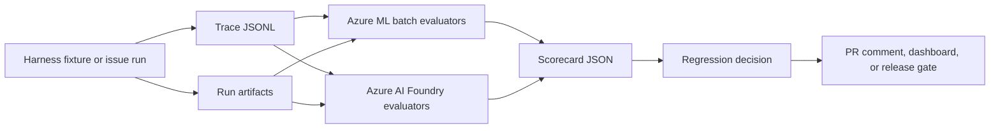

# Azure Evaluation Runtime

## Purpose

This page defines how Azure AI Foundry and Azure Machine Learning can run the
harness evaluation suite without replacing the harness's own evaluation
contract. The repository remains the source of truth for metrics, fixtures,
trace schema, graders, thresholds, and blocking policy. Azure provides managed
execution, experiment tracking, scalable batch runs, and model-upgrade shadow
comparisons.

## Runtime Boundary

Azure is an execution and reporting layer, not the definition of correctness.
Every Azure-backed eval must still point back to the same fields described in
[evaluation-matrix.md](evaluation-matrix.md): target, capability, boundary, mode,
dataset, grader, trials, threshold, artifacts, and owner.

Use this split:

| Surface | Best use | Why |
| --- | --- | --- |
| Local / GitHub Actions | L0 lifecycle checks, schema checks, deterministic mutation tripwires, fast security checks | Cheap, deterministic, and suitable for PR blocking. |
| Azure Machine Learning | Batch trace evaluation, cost baselines, latency distributions, loop/thrash detection, model/tool upgrade comparisons | Strong fit for repeatable jobs, versioned artifacts, metrics, and scheduled runs. |
| Azure AI Foundry | Agent, skill, outcome, and LLM-as-judge evaluations over test datasets | Strong fit for AI app evaluation, model comparison, judge runs, and managed evaluation history. |

## Recommended Flow

The first implementation should keep local and CI runners working. Azure-backed
runs consume the same trace and fixture artifacts those local runners produce.
That keeps Azure optional for contributors while still making nightly,
pre-upgrade, and high-cost suites scalable.

## Artifact Contract

An Azure evaluation run should consume and produce explicit artifacts so results
can be reproduced outside Azure when needed.

Inputs:

- Versioned fixture dataset or query/response dataset.
- `trace.jsonl` following
  [observability-and-trace-schema.md](observability-and-trace-schema.md).
- Harness run artifacts, such as diffs, test output summaries, Action Log
  excerpts, review verdicts, and feature status.
- Evaluator configuration naming metrics, thresholds, trial count, and blocking
  mode.

Outputs:

- `scorecard.json` with per-capability pass/fail, metric values, and threshold
  decisions.
- `eval-summary.md` for human review.
- Updated baseline candidate files for approved re-baselining workflows.
- Links or run ids for Azure ML jobs, Foundry evaluation runs, and stored
  artifacts.

Every run records:

- Commit SHA.
- Dataset version.
- Trace schema version.
- Evaluator code version.
- Model and judge model versions.
- Tool versions.
- Azure project or workspace id.
- Price schedule version when cost is reported.

## Azure Machine Learning Responsibilities

Use Azure Machine Learning for deterministic or mostly deterministic batch
evaluators that operate over traces and artifacts:

- Cost and efficiency counters from
  [cost-efficiency-evals.md](cost-efficiency-evals.md).
- Latency distributions, including median, p75, p95, and variance bands.
- Tool-call, retry, and loop/thrash detectors.
- Trace schema validation over a large corpus.
- Same-model regression checks against stored baselines.
- Model/tool upgrade shadow comparisons before a new baseline is accepted.

Azure ML jobs should be reproducible from source-controlled evaluator code and a
declared environment. The job output should be usable without opening the Azure
portal: the scorecard and summary files are the durable contract.

## Azure AI Foundry Responsibilities

Use Azure AI Foundry for evaluations where the target or grader is an AI app,
agent, model, or LLM judge:

- Skill trigger and skill output evaluations.
- Planner, tester, implementer, and reviewer role evaluations.
- Outcome fixture quality evaluations.
- Judge calibration against gold labels from
  [judge-evaluation.md](judge-evaluation.md).
- Model and prompt comparisons for agent behavior.

Foundry runs should start from an explicit dataset: queries, expected outputs or
labels, actual responses, and metadata. If the response is produced by running a
harness agent, the runner must save both the response and the trace that led to
it. A Foundry score should not be allowed to override deterministic lifecycle,
security, or trace failures from the repository evaluators.

## Gating Policy

Keep gates layered:

- PR-blocking gates stay local or in GitHub Actions when they are cheap and
  deterministic.
- Azure ML can block scheduled release or upgrade gates when baseline comparison
  is required.
- Azure AI Foundry can block only after the judge or evaluator has been
  calibrated as described in [judge-evaluation.md](judge-evaluation.md).
- Capability-mode evaluations report movement but do not block until promoted to
  regression mode in [evaluation-matrix.md](evaluation-matrix.md).

Cost gates are always quality-gated: a cheaper run that skips required tests,
review, approval pauses, or security checks is a failure, not an improvement.

## Security And Data Handling

Azure-backed evals must follow the repository sensitivity rules:

- Do not upload customer-supplied raw media, screenshots, decks, exports,
  secrets, or unsanitized issue data.
- Redact traces before upload and record redaction status in the trace metadata.
- Use synthetic secret markers for security fixtures, never real credentials.
- Use managed identity or approved federated credentials for automation.
- Store secrets in Key Vault or platform-managed configuration, not fixtures,
  traces, or evaluator code.
- Apply least-privilege RBAC to Foundry projects, Azure ML workspaces, storage,
  and registries.

## Adoption Plan

1. Emit local `trace.jsonl`, `scorecard.json`, and `eval-summary.md` artifacts
   for one fixture.
2. Run the same deterministic evaluator locally and in Azure ML, then compare
   outputs byte-for-byte where practical.
3. Add Azure ML nightly cost and trajectory batch runs over a small fixture
   corpus.
4. Add Azure AI Foundry judge calibration for the review subagent after gold
   labels exist.
5. Wire model/tool upgrade shadow runs into the release cadence.

## Acceptance Criteria

- Azure-backed evals consume the same fixtures and traces as local evaluators.
- Every Azure run produces durable scorecard and summary artifacts in addition
  to portal-visible metrics.
- Azure ML is used for batch trace, cost, and baseline evaluation.
- Azure AI Foundry is used for AI app, agent, and calibrated judge evaluation.
- No Azure score can mask a local deterministic lifecycle, security, or quality
  failure.
- Uploaded artifacts are redacted and versioned.