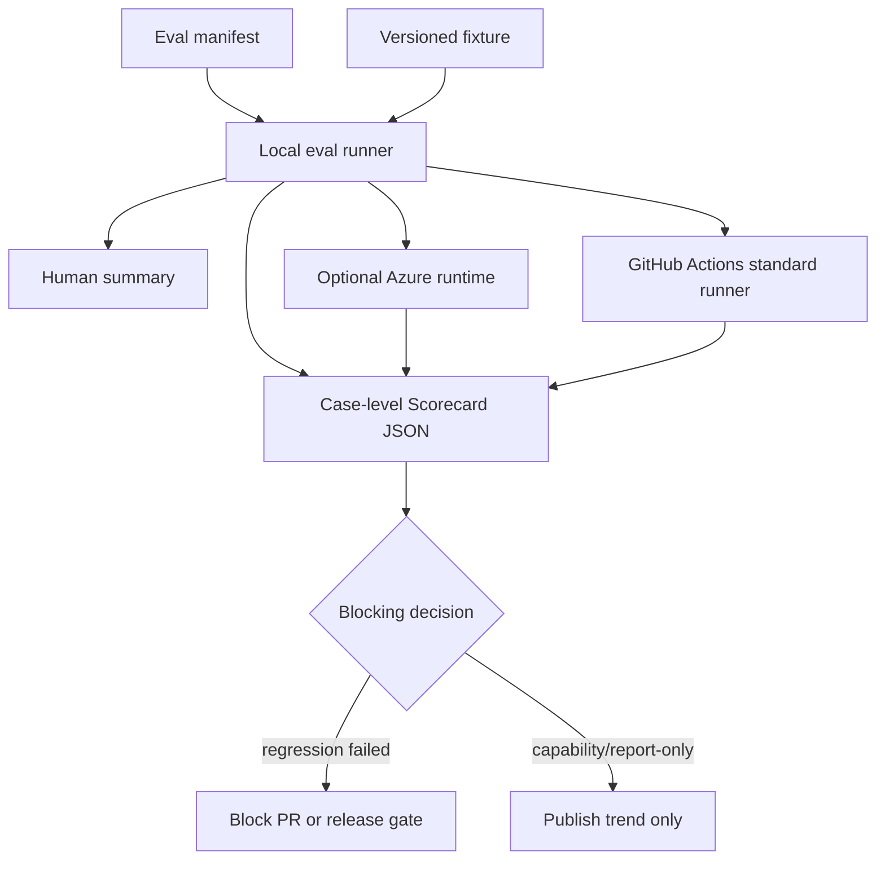
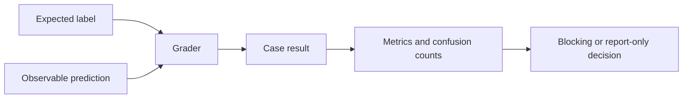

# L0/L1 Evaluation Architecture

## Scope

This architecture covers only the evaluation surfaces that can be made useful
before a full agent trace system exists:

- L0 shell lifecycle and contract checks.
- L1 skill trigger, artifact, and deterministic behavior checks.
- Optional Azure execution for expensive L1 runs after local execution is
  stable.

It intentionally avoids depending on L3 trace emission, Azure resources, or
LLM-as-judge calibration as prerequisites for the first runnable solution.

## Runtime Topology

The local runner is the contract authority. GitHub Actions and Azure are runtime
surfaces that execute the same manifests and must preserve the same case-level
scorecard schema.

## Measurement Flow

Every eval must define both a label and an observable prediction. A prompt row
that says a skill should trigger is only a label; it becomes an eval only when
the runner can observe the predicted skill selection, artifact, or structured
output.

## Layer Responsibilities

### L0 Script Lifecycle

L0 evaluates deterministic harness behavior. It is unit-test-like in execution
but lifecycle-contract-oriented in purpose. It must use shell tests, fake CLIs,
temporary repositories, and observable file/git state rather than model output.

Blocking L0 capabilities include:

- Required scripts exist, are executable, and parse under Bash.
- The lifecycle contract remains present and internally consistent.
- `start-issue.sh` refuses to create branches or worktrees after preflight
  failure.
- `create-pr.sh` refuses to push or create PRs without a fresh review-gate
  approval.
- `finish-issue.sh` refuses unsafe cleanup when feature completion or worktree
  cleanliness requirements fail.
- Hard failures and warning-only paths are verified by exit code and state, not
  only by text presence.

### L1 Skills

L1 evaluates `.copilot/skills/*` assets. It is only valid when the runner can
observe the prediction it is scoring: direct skill-selection telemetry, a stable
command/tool invocation, a deterministic proxy artifact, or structured output
that declares the skill id. Without one of those signals, a trigger prompt set is
only a labeled dataset draft.

L1 has three maturity levels:

| Level | Gate status | Allowed graders | Example |
| --- | --- | --- | --- |
| L1a trigger | Report-only until observation and dataset review are stable | Skill-selection telemetry, command route, proxy artifact, or structured `skill_id` | `code-review` triggers on explicit review prompts and not README summaries. |
| L1b artifact | Blocking after schema stabilizes | File existence, schema, required sections, forbidden file changes | `create-pr` output includes issue link and acceptance criteria. |
| L1c behavior | Report-only until calibrated | Deterministic checks first; calibrated rubric later | Review findings are severity ordered and cite real evidence. |

L1 must not become a hidden LLM-as-judge gate. Any rubric grader that can block
requires a versioned gold label set, judge prompt/version pinning, and measured
critical false-negative rate.

## Runner Contract

The runner reads manifests, executes eval cases, and writes a case-level
scorecard. A runner invocation must be reproducible from:

- Git commit SHA.
- Manifest file path and version.
- Fixture path and version.
- Fixture hash.
- Dataset version for L1.
- Runner version.
- Tool versions.
- Runtime surface: `local`, `github-actions`, or `azure`.

Generated scorecards must contain no secrets or unsanitized issue data. They
must preserve case-level results, dataset version, fixture hash, false-positive
and false-negative counts, skip reasons, and failure type so later trend analysis
does not collapse into a single opaque pass/fail.

## Tier A Boundary — GitHub Actions (deterministic, blocking)

Tier A is every eval with a deterministic grader. It runs locally and in GitHub
Actions, and it is part of the CI pipeline: the existing harness-smoke workflow
already runs the L0 shell sensors and a basic SKILL.md frontmatter check, so the
deterministic eval layer is an extension of CI rather than a separate system.
Tier A blocks PRs.

Tier A scope:

- L0 script-lifecycle and contract checks.
- Deterministic L1 checks: SKILL.md frontmatter validation, description
  discriminability against a pinned embedding model, and artifact schema checks
  for skills that produce files.

GitHub Actions is treated as a constrained runtime:

- Prefer Linux standard runners.
- Keep PR-blocking jobs fast and deterministic.
- Avoid larger runners for free public-repo gates; larger runners are a paid
  path.
- Keep artifacts small and short-lived.
- Do not run any live-model eval here; those are Tier B.
- Do not store Azure tenant/subscription/resource identifiers in workflow YAML.

## Tier B Boundary — Azure (model-driven, report-only)

Tier B is every eval that needs a live model call. Azure is its committed home,
not an optional afterthought. Tier B runs on a nightly or on-demand schedule and
is **never a required PR gate** — a public repo must not couple external
contributors' PRs to the maintainer's Azure subscription, cost, or quota.

Tier B scope:

- Live skill-selection trigger runs (a Copilot CLI session Azure drives, or a
  pinned-model routing proxy).
- LLM-as-judge skill behavior scoring after judge calibration exists.
- Multi-trial reliability datasets and `pass^k` reporting.
- Long-retention scorecards, trend reports, and model/tool upgrade shadow
  comparisons.

Two boundaries Azure does not move:

- **Correctness.** Azure consumes the same manifests and fixtures as the local
  runner and emits the same scorecard schema. It cannot redefine pass/fail.
- **Observability.** Azure provides compute, orchestration, retention, and
  managed identity. It does not provide access to the host IDE's skill selector.
  A live trigger eval on Azure measures a pinned-model proxy or a CLI-driven
  signal, and must stay labeled as a proxy, never as VS Code Copilot's internal
  selection.

## Azure Configuration And Secret Policy

Azure identifiers and credentials are runtime configuration, not repository
configuration.

Allowed locations:

- Local untracked `.env` files.
- Developer shell environment.
- GitHub Actions secrets or environments.
- Azure federated identity configuration.
- Azure Key Vault or managed platform configuration.

Forbidden locations:

- Markdown docs.
- Eval manifests.
- Workflow YAML.
- Fixture files.
- Scorecards committed to git.
- Prompt datasets.

Manifest fields may reference logical names such as `runtime_profile:
azure-l1-nightly`, but the mapping from that profile to tenant, subscription,
workspace, or project identifiers must remain outside tracked files.

## Failure Handling

- Tier A (deterministic) failures block immediately: L0 regressions always, and
  deterministic L1 checks (frontmatter, schema) once the skill is marked mature
  in the manifest.
- Tier B (model-driven) failures are report-only and never block a PR; they move
  trend lines, not merge gates.
- L1c behavior failures stay report-only until judge calibration exists.
- Tier B (Azure) failure cannot make a failing Tier A deterministic check pass.
- Missing Azure configuration skips Tier B jobs with an explicit `not_run`
  scorecard status; it must not fail local or GitHub Actions Tier A validation.

## Maturity Gates

An L1 eval is not mature merely because it has prompts. It needs reviewed labels,
an observable prediction signal, case-level scorecards, and false-positive /
false-negative reporting. A trigger eval should not become blocking until the
target skill has a reviewed dataset across explicit positive, implicit positive,
contextual positive, negative-control, and ambiguous strata.