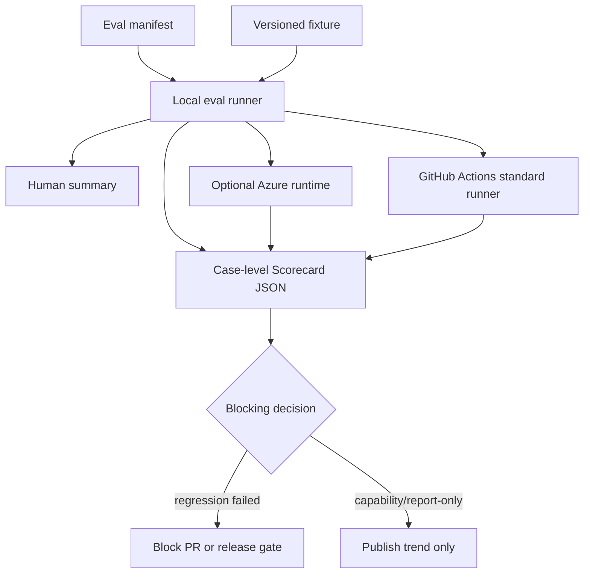
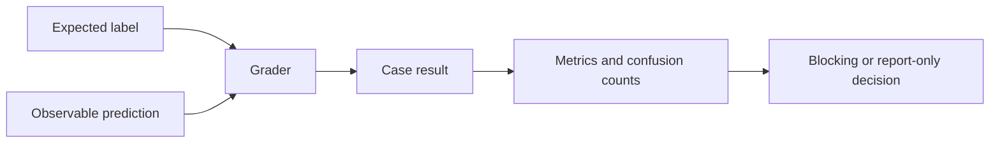

# L0 Evaluation Architecture

## Scope

This architecture covers the deterministic foundation layer and the shared eval
framework that later layers reuse:

- L0 shell lifecycle and contract checks.
- The runner contract, scorecard schema, Tier A boundary, and Azure config/secret
  policy that the L1 layer depends on.

It intentionally avoids depending on L3 trace emission, Azure resources, or
LLM-as-judge calibration as prerequisites for the first runnable solution. The L1
skills layer, its maturity model, and the Tier B model-driven boundary are
specified in [../l1-solution/architecture.md](../l1-solution/architecture.md).

## Runtime Topology

The local runner is the contract authority. GitHub Actions and Azure are runtime
surfaces that execute the same manifests and must preserve the same case-level
scorecard schema.

## Measurement Flow

Every eval must define both a label and an observable prediction. For L0 this is
always a deterministic exit code, git state, or file state. The same measurement
chain applies to the L1 layer, where the prediction is an observed skill
selection, artifact, or structured output.

## Layer Responsibilities

### L0 Script Lifecycle

L0 evaluates deterministic harness behavior. It is unit-test-like in execution
but lifecycle-contract-oriented in purpose. It must use shell tests, fake CLIs,
temporary repositories, and observable file/git state rather than model output.

Blocking L0 capabilities include:

- Required scripts exist, are executable, and parse under Bash.
- The lifecycle contract remains present and internally consistent.
- `start-issue.sh` refuses to create branches or worktrees after preflight
  failure.
- `create-pr.sh` refuses to push or create PRs without a fresh review-gate
  approval.
- `finish-issue.sh` refuses unsafe cleanup when feature completion or worktree
  cleanliness requirements fail.
- Hard failures and warning-only paths are verified by exit code and state, not
  only by text presence.

## Runner Contract

The runner reads manifests, executes eval cases, and writes a case-level
scorecard. A runner invocation must be reproducible from:

- Git commit SHA.
- Manifest file path and version.
- Fixture path and version.
- Fixture hash.
- Dataset version when the case carries one.
- Runner version.
- Tool versions.
- Runtime surface: `local`, `github-actions`, or `azure`.

Generated scorecards must contain no secrets or unsanitized issue data. They
must preserve case-level results, dataset version, fixture hash, false-positive
and false-negative counts, skip reasons, and failure type so later trend analysis
does not collapse into a single opaque pass/fail.

## Tier A Boundary — GitHub Actions (deterministic, blocking)

Tier A is every eval with a deterministic grader. It runs locally and in GitHub
Actions, and it is part of the CI pipeline: the existing harness-smoke workflow
already runs the L0 shell sensors and the shared skill/agent structural
validator at `tests/evals/bin/validate-customization-frontmatter.sh`, so the
deterministic eval layer is an extension of CI rather than a separate system.
Tier A blocks PRs.

Tier A scope owned here:

- L0 script-lifecycle and contract checks.

Tier A also covers the deterministic slice of the L1 layer (SKILL.md frontmatter
validation, description-discriminability proxy, and artifact schema checks); those
are specified in [../l1-solution/architecture.md](../l1-solution/architecture.md).

GitHub Actions is treated as a constrained runtime:

- Prefer Linux standard runners.
- Keep PR-blocking jobs fast and deterministic.
- Avoid larger runners for free public-repo gates; larger runners are a paid
  path.
- Keep artifacts small and short-lived.
- Do not run any live-model eval here; those are Tier B.
- Do not store Azure tenant/subscription/resource identifiers in workflow YAML.

## Tier B Boundary — Azure (model-driven, report-only)

Tier B is every eval that needs a live model call. Azure is its committed home,
not an optional afterthought. Tier B runs on a nightly or on-demand schedule and
is **never a required PR gate** — a public repo must not couple external
contributors' PRs to the maintainer's Azure subscription, cost, or quota.

No L0 eval is Tier B; L0 is entirely deterministic. The Tier B scope and its
observability boundary (Azure does not provide access to the host IDE's skill
selector) are detailed in
[../l1-solution/architecture.md](../l1-solution/architecture.md), where the first
model-driven evals live. Two boundaries Azure never moves are defined by this
framework:

- **Correctness.** Azure consumes the same manifests and fixtures as the local
  runner and emits the same scorecard schema. It cannot redefine pass/fail.
- **Observability.** Azure provides compute, orchestration, retention, and
  managed identity. It does not provide access to the host IDE's skill selector.

## Azure Configuration And Secret Policy

Azure identifiers and credentials are runtime configuration, not repository
configuration.

Allowed locations:

- Local untracked `.env` files.
- Developer shell environment.
- GitHub Actions secrets or environments.
- Azure federated identity configuration.
- Azure Key Vault or managed platform configuration.

Forbidden locations:

- Markdown docs.
- Eval manifests.
- Workflow YAML.
- Fixture files.
- Scorecards committed to git.
- Prompt datasets.

Manifest fields may reference logical names such as `runtime_profile:
azure-l1-nightly`, but the mapping from that profile to tenant, subscription,
workspace, or project identifiers must remain outside tracked files.

## Failure Handling

- Tier A (deterministic) failures block immediately: L0 regressions always.
- Tier B (model-driven) failures are report-only and never block a PR; they move
  trend lines, not merge gates.
- Tier B (Azure) failure cannot make a failing Tier A deterministic check pass.
- Missing Azure configuration skips Tier B jobs with an explicit `not_run`
  scorecard status; it must not fail local or GitHub Actions Tier A validation.
