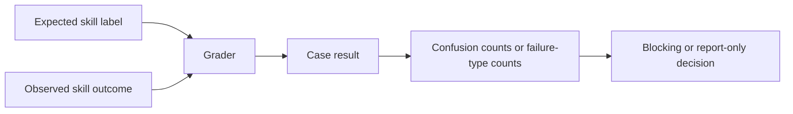

# L1 Evaluation Architecture

## Scope

This architecture covers the skills layer only:

- L1 skill trigger, artifact, and deterministic behavior checks.
- The Tier B model-driven boundary and its observability limits.

L1 reuses the runner contract, scorecard schema, Tier A boundary, and Azure
config/secret policy defined by the L0 solution. Read
[../l0-solution/architecture.md](../l0-solution/architecture.md) for those shared
elements; this document does not restate them. L1 avoids depending on L3 trace
emission or LLM-as-judge calibration as prerequisites for its first runnable
slice.

## Measurement Flow

L1 follows the same label/prediction/grader chain as the framework, but the
prediction is a skill outcome rather than a shell exit code:

A prompt row that says a skill should trigger is only a label; it becomes an eval
only when the runner can observe the predicted skill selection, artifact, or
structured output.

## Layer Responsibilities

L1 evaluates `.copilot/skills/*` assets. It is only valid when the runner can
observe the prediction it is scoring: direct skill-selection telemetry, a stable
command/tool invocation, a deterministic proxy artifact, or structured output
that declares the skill id. Without one of those signals, a trigger prompt set is
only a labeled dataset draft.

L1 has three maturity levels:

| Level | Gate status | Allowed graders | Example |
| --- | --- | --- | --- |
| L1a trigger | Report-only until observation and dataset review are stable | Skill-selection telemetry, command route, proxy artifact, or structured `skill_id` | `code-review` triggers on explicit review prompts and not README summaries. |
| L1b artifact | Blocking after schema stabilizes | File existence, schema, required sections, forbidden file changes | `create-pr` output includes issue link and acceptance criteria. |
| L1c behavior | Report-only until calibrated | Deterministic checks first; calibrated rubric later | Review findings are severity ordered and cite real evidence. |

L1 must not become a hidden LLM-as-judge gate. Any rubric grader that can block
requires a versioned gold label set, judge prompt/version pinning, and measured
critical false-negative rate.

## Tier A Placement — Deterministic L1 (blocking)

L1's deterministic slice runs under the framework's Tier A boundary (local +
GitHub Actions, blocking, no Azure). Tier A L1 scope:

- SKILL.md frontmatter validation.
- Description discriminability against a pinned embedding model.
- Artifact schema checks for skills that produce files.

These extend the existing CI pipeline that already runs the L0 shell sensors and
the shared skill/agent structural validator at
`tests/evals/bin/validate-customization-frontmatter.sh`. Frontmatter validation
blocks directly in CI; other L1 evals follow their specified maturity and
promotion rules.

## Tier B Boundary — Azure (model-driven, report-only)

Tier B is every eval that needs a live model call, and L1 is where Tier B first
applies. Azure is its committed home, not an optional afterthought. Tier B runs on
a nightly or on-demand schedule and is **never a required PR gate** — a public
repo must not couple external contributors' PRs to the maintainer's Azure
subscription, cost, or quota.

Tier B L1 scope:

- Live skill-selection trigger runs (a Copilot CLI session Azure drives, or a
  pinned-model routing proxy).
- LLM-as-judge skill behavior scoring after judge calibration exists.
- Multi-trial reliability datasets and `pass^k` reporting.
- Long-retention scorecards, trend reports, and model/tool upgrade shadow
  comparisons.

Two boundaries Azure does not move:

- **Correctness.** Azure consumes the same manifests and fixtures as the local
  runner and emits the same scorecard schema. It cannot redefine pass/fail.
- **Observability.** Azure provides compute, orchestration, retention, and
  managed identity. It does not provide access to the host IDE's skill selector.
  A live trigger eval on Azure measures a pinned-model proxy or a CLI-driven
  signal, and must stay labeled as a proxy, never as VS Code Copilot's internal
  selection.

## Failure Handling

- Frontmatter validation blocks directly in local smoke and GitHub Actions.
  Manifest-backed deterministic schema checks block only after their specified
  maturity and promotion criteria are met.
- Tier B (model-driven) failures are report-only and never block a PR; they move
  trend lines, not merge gates.
- L1c behavior failures stay report-only until judge calibration exists.
- Tier B (Azure) failure cannot make a failing Tier A deterministic check pass.
- Missing Azure configuration skips Tier B jobs with an explicit `not_run`
  scorecard status; it must not fail local or GitHub Actions Tier A validation.

## Maturity Gates

An L1 eval is not mature merely because it has prompts. It needs reviewed labels,
an observable prediction signal, case-level scorecards, and false-positive /
false-negative reporting. A trigger eval should not become blocking until the
target skill has a reviewed dataset across explicit positive, implicit positive,
contextual positive, negative-control, and ambiguous strata.
